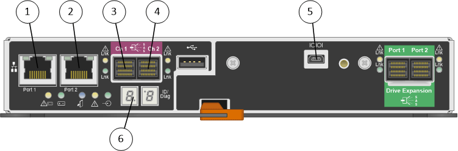

= Hardwarediagramme
:allow-uri-read: 
:icons: font
:imagesdir: ../media/

[role="lead"]
Die SG5612 und SG5660 Modelle der StorageGRID Appliance umfassen einen E2700 Controller und einen E5600SG Controller. Sie sollten sich die Diagramme ansehen, um sich über die Unterschiede zwischen den Modellen und den Controllern zu informieren.

== Modell SG5612 2 HE: Rückansicht des E2700 Controllers und E5600SG Controller

image::../media/sg5612_2u_rear_view.gif[Ansicht der SG5612 mit zwei Controllern]

|===
| Legende | Beschreibung 

 a| 
1
 a| 
E2700 Controller

 a| 
2
 a| 
E5600SG-Controller

|===

== Modell SG5660 4U: Rückansicht des E2700 Controllers und E5600SG Controller

Der E2700 Controller befindet sich über dem E5600SG Controller.

image::../media/sg5660_4u_rear_view.gif[Rückseite der SG5660 mit zwei Controllern]

|===
| Legende | Beschreibung 

 a| 
1
 a| 
E2700 Controller

 a| 
2
 a| 
E5600SG-Controller

|===

== Rückansicht des E2700 Controllers

|===
| Legende | Beschreibung 

 a| 
1
 a| 
Management-Port 1 (Verbinden Sie mit dem Netzwerk, in dem SANtricity Storage Manager installiert ist.)

 a| 
2
 a| 
Management-Port 2 (bei der Installation zum Herstellen einer Verbindung zu einem Laptop verwenden)

 a| 
3
 a| 
SAS-Interconnect-Port 1

 a| 
4
 a| 
SAS-Interconnect-Port 2

 a| 
5
 a| 
Serieller Anschluss

 a| 
6
 a| 
Sieben-Segment-Anzeige

|===

NOTE: Es werden nicht die beiden SAS-Ports namens Drive Expansion (grün) auf der Rückseite des E2700 Controllers verwendet. Die StorageGRID Appliance unterstützt keine Festplatten-Shelfs zur Erweiterung.

== Rückansicht des E5600SG-Controllers

image::../media/sga_controller_5600_diagram_callouts.gif[E5600 Diagramm]

|===
| Legende | Beschreibung 

 a| 
1
 a| 
Management-Port 1CONNECT zum Admin-Netzwerk für StorageGRID.

 a| 
2
 a| 
Management-Port 2 Optionen:

* Verbindung mit Management-Port 1 für eine redundante Verbindung zum Admin-Netzwerk für StorageGRID.
* Lassen Sie nicht verdrahtet und für den vorübergehenden lokalen Zugang verfügbar (IP 169.254.0.1).
* Verwenden Sie während der Installation für die IP-Konfiguration, wenn DHCP-zugeordnete IP-Adressen nicht verfügbar sind.

 a| 
3
 a| 
SAS-Interconnect-Port 1

 a| 
4
 a| 
SAS-Interconnect-Port 2

 a| 
5
 a| 
Fehler- und aktiv-LEDs für 10-GbE-Netzwerkanschluss 1

 a| 
6
 a| 
Fehler- und aktiv-LEDs für 10-GbE-Netzwerkanschluss 2

 a| 
7
 a| 
Fehler- und aktiv-LEDs für 10-GbE-Netzwerkanschluss 3

 a| 
8
 a| 
Fehler- und aktiv-LEDs für 10-GbE-Netzwerkanschluss 4

 a| 
9
 a| 
LED für Warnung

 a| 
10
 a| 
Sieben-Segment-Anzeige

 a| 
11
 a| 
10-GbE-Netzwerkanschluss 1

 a| 
12
 a| 
10-GbE-Netzwerkanschluss 2

 a| 
13
 a| 
10-GbE-Netzwerkanschluss 3

 a| 
14
 a| 
10-GbE-Netzwerkanschluss 4

|===

NOTE: Die Host Interface Card (HIC) des StorageGRID Appliance E5600SG Controllers unterstützt nur 10-GB-Ethernet-Verbindungen. Er kann nicht für iSCSI-Verbindungen verwendet werden.
