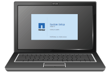

= Zusätzliche Ausrüstung und Tools (SG5600)
:allow-uri-read: 
:icons: font
:imagesdir: ../media/

[role="lead"]
Vergewissern Sie sich vor der Installation der SG5600 Appliance, dass alle zusätzlichen Geräte und Tools zur Verfügung stehen, die Sie benötigen.

* *Schraubendreher*
+
image::../media/appliance_screwdrivers.gif[Schraubendreher]

+
Phillips Nr. 2 Schraubendreher

+
Mittlere Flachschraubendreher

* *ESD-Handgelenkschlaufe*
+
image::../media/appliance_wriststrap.gif[ESD-Handgelenkschlaufe]

* * Ethernet-Kabel*
+
image::../media/appliance_ethernet_cables.gif[Ethernet-Kabel]

* *Ethernet-Switch*
+
image::../media/appliance_ethernet_switch_network_hub.gif[Ethernet-Hub]

* *Service-Laptop*xref:../admin/web-browser-requirements.adoc[Unterstützter Webbrowser]
+

