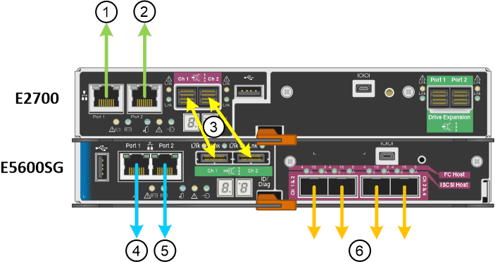

= Appliance-Netzwerkverbindungen (SG5600) prüfen
:allow-uri-read: 
:icons: font
:imagesdir: ../media/

[role="lead"]
Vor der Installation der StorageGRID Appliance sollten Sie wissen, welche Netzwerke mit der Appliance verbunden werden können und wie die Ports auf den einzelnen Controllern verwendet werden.

== StorageGRID Appliance-Netzwerke

Wenn Sie eine StorageGRID Appliance als Storage Node bereitstellen, können Sie sie mit folgenden Netzwerken verbinden:

* *Grid-Netzwerk für StorageGRID*: Das Grid-Netzwerk wird für den gesamten internen StorageGRID-Datenverkehr verwendet. Das System bietet Konnektivität zwischen allen Nodes im Grid und allen Standorten und Subnetzen. Das Grid-Netzwerk ist erforderlich.
* *Admin-Netzwerk für StorageGRID*: Das Admin-Netzwerk ist ein geschlossenes Netzwerk, das zur Systemadministration und Wartung verwendet wird. Das Admin-Netzwerk ist in der Regel ein privates Netzwerk und muss nicht zwischen Standorten routingfähig sein. Das Admin-Netzwerk ist optional.
* *Client-Netzwerk für StorageGRID*: Das Client-Netzwerk ist ein offenes Netzwerk, das für den Zugriff auf Client-Anwendungen, einschließlich S3 und Swift, verwendet wird. Das Client-Netzwerk ermöglicht den Zugriff auf das Grid-Protokoll, sodass das Grid-Netzwerk isoliert und gesichert werden kann. Das Client-Netzwerk ist optional.
* *Managementnetzwerk für SANtricity Storage Manager* (optional): Der E2700 Controller stellt eine Verbindung zum Managementnetzwerk her, in dem SANtricity Storage Manager installiert ist. Damit können Sie die Hardwarekomponenten der Appliance überwachen und managen. Dieses Managementnetzwerk kann das gleiche sein wie das Admin-Netzwerk für StorageGRID, oder es kann ein unabhängiges Managementnetzwerk sein.
+
Wenn das optionale SANtricity-Speichermanager-Netzwerk nicht verbunden ist, können Sie einige SANtricity-Funktionen möglicherweise nicht verwenden.

NOTE: Ausführliche Informationen zu StorageGRID-Netzwerken finden Sie unter _Rasterprimer_.

== Verbindungen zu StorageGRID-Appliances

Wenn Sie eine StorageGRID-Appliance installieren, müssen Sie die beiden Controller miteinander und mit den erforderlichen Netzwerken verbinden. Die Abbildung zeigt die beiden Controller in der SG5660, wobei der E2700 Controller oben und der E5600SG Controller unten gezeigt werden. In der SG5612 befindet sich der E2700 Controller links vom E5600SG Controller.

|===
| Element | Port | Typ des Ports | Funktion 

 a| 
1
 a| 
Management-Port 1 am E2700 Controller
 a| 
1-GB-Ethernet (RJ-45
 a| 
Verbindet den E2700 Controller mit dem Netzwerk, in dem SANtricity Storage Manager installiert wird.

 a| 
2
 a| 
Management-Port 2 am E2700 Controller
 a| 
1-GB-Ethernet (RJ-45
 a| 
Verbindet den E2700 Controller während der Installation mit einem Service-Laptop.

 a| 
3
 a| 
Zwei SAS Interconnect Ports an jedem Controller, gekennzeichnet mit CH 1 und CH 2
 a| 
E2700 Controller: Mini-SAS-HD

E5600SG Controller: Mini-SAS
 a| 
Verbinden Sie die beiden Controller miteinander.

 a| 
4
 a| 
Management-Port 1 am E5600SG-Controller
 a| 
1-GB-Ethernet (RJ-45
 a| 
Verbindet den E5600SG-Controller mit dem Admin-Netzwerk für StorageGRID.

 a| 
5
 a| 
Management-Port 2 am E5600SG-Controller
 a| 
1-GB-Ethernet (RJ-45
 a| 
* Kann mit Verwaltungsport 1 verbunden werden, wenn Sie eine redundante Verbindung zum Admin-Netzwerk wünschen.
* Kann unverkabelt und für temporären lokalen Zugang verfügbar sein (IP 169.254.0.1).
* Kann verwendet werden, um den E5600SG-Controller während der Installation mit einem Service-Laptop zu verbinden, wenn keine DHCP-zugewiesene IP-Adresse verfügbar ist.

 a| 
6
 a| 
Vier Netzwerk-Ports am E5600SG Controller
 a| 
10 GbE (optisch)
 a| 
Stellen Sie eine Verbindung zum Grid-Netzwerk und dem Client-Netzwerk für StorageGRID her. Siehe „`10-GbE-Port-Verbindungen für den E5600SG-Controller`“.

|===
.Verwandte Informationen
xref:port-bond-modes-for-e5600sg-controller-ports.adoc[Port Bond-Modi für die E5600SG Controller-Ports]

xref:gathering-installation-information-sg5600.adoc[Erfassen von Installationsinformationen (SG5600)]

xref:cabling-appliance-sg5600.adoc[Kabelgerät (SG5600)]

xref:../network/index.adoc[Netzwerkrichtlinien]

xref:../vmware/index.adoc[VMware installieren]

xref:../rhel/index.adoc[Installieren Sie Red hat Enterprise Linux oder CentOS]

xref:../ubuntu/index.adoc[Installieren Sie Ubuntu oder Debian]
