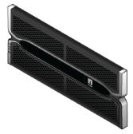

= Auspackboxen (SG5600)
:allow-uri-read: 
:icons: font
:imagesdir: ../media/

[role="lead"]
Packen Sie vor der Installation des StorageGRID-Geräts alle Kartons aus und vergleichen Sie den Inhalt mit den Artikeln auf dem Verpackungsschein.

* *SG5660 Gehäuse, ein 4-HE-Gehäuse mit 60 Laufwerken*
+
image::../media/appliance_enclosure.gif[4-HE-Gehäuse]

* *SG5612-Gehäuse, 2-HE-Chassis mit 12 Laufwerken*
+
image::../media/appliance_enclosure_2u.gif[DE1600 2-HE-Chassis]

* *4U-Blende oder 2U-Endkappen*
+
 image:../media/appliance_bezel_2u_endcaps.gif["2-HE-Endkappen"]

* *NL-SAS-Laufwerke*
+
image::../media/appliance_drive.gif[Laufwerk]

+
Laufwerke sind zur Sicherheit beim Versand in der SG5612 mit 2 HE vorinstalliert, jedoch nicht in der 4 HE SG5660.

* * E5600SG Controller*
+
image::../media/sga_controller_5600_diagram.gif[E5600 Controller]

* *E2700 Controller*
+
image::../media/sga_controller_2700_diagram.gif[E2700 Controller]

* *Befestigungsschienen und Schrauben*
+
image::../media/appliance_mounting_rail_kit.png[Befestigungsschienen-Kit]

* *Gehäusegriffe (nur 4-HE-Gehäuse)*
+
image::../media/appliance_enclosure_handles.gif[Gehäusegriffe]

== Kabel und Anschlüsse

Der Versand für das StorageGRID Gerät umfasst die folgenden Kabel und Anschlüsse:

* *Stromkabel für Ihr Land*
+
image::../media/appliance_power_cords.gif[Stromkabel]

+
Das Gerät wird mit zwei Wechselstromkabeln an eine externe Stromquelle, z. B. an einen Netzstecker, angeschlossen. Ihr Schrank verfügt möglicherweise über spezielle Netzkabel, die Sie anstelle der Netzkabel verwenden, die Sie zur Einheit mit dem Gerät anschließen.

* *SAS-Verbindungskabel*
+
image::../media/appliance_mini_sas_cables.gif[Mini-SAS-Kabel]

+
Zwei 0.5-Meter-SAS-Verbindungskabel mit Mini-SAS-HD- und Mini-SAS-Anschlüssen.

+
Der quadratische Stecker wird an den E2700 Controller angeschlossen und der rechteckige Stecker wird an den E5600SG Controller angeschlossen.

