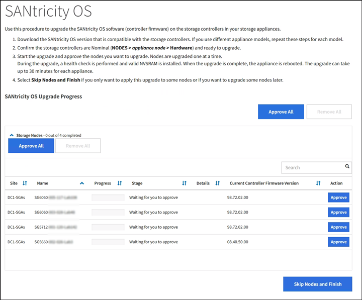

= Aktualisieren Sie SANtricity OS auf Storage-Controllern mit Grid Manager
:allow-uri-read: 
:icons: font
:imagesdir: ../media/

[role="lead"]
Bei Storage-Controllern, die derzeit SANtricity OS 08.42.20.00 (11.42) oder eine neuere Version verwenden, müssen Sie zum Anwenden eines Upgrades den Grid-Manager verwenden.

.Was Sie benötigen
* Sie haben das NetApp Interoperabilitäts-Matrix-Tool (IMT) konsultiert, um zu überprüfen, ob die für das Upgrade verwendete SANtricity Betriebssystemversion mit Ihrer Appliance kompatibel ist.
* Sie haben die Berechtigung Wartung oder Stammzugriff.
* Sie sind mit einem bei Grid Manager angemeldet xref:../admin/web-browser-requirements.adoc[Unterstützter Webbrowser].
* Sie haben die Provisionierungs-Passphrase.
* Sie haben Zugriff auf die NetApp Download-Seite für SANtricity OS.

.Über diese Aufgabe
Sie können keine anderen Softwareupdates (StorageGRID Software-Upgrade oder Hotfix) durchführen, bis Sie den SANtricity OS-Upgrade-Prozess abgeschlossen haben. Wenn Sie versuchen, vor Abschluss des SANtricity OS-Upgrades einen Hotfix oder ein StorageGRID-Software-Upgrade zu starten, werden Sie zur Upgrade-Seite von SANtricity OS umgeleitet.

Das Verfahren ist erst abgeschlossen, wenn das SANtricity OS Upgrade erfolgreich auf alle zutreffenden Nodes angewendet wurde, die für das Upgrade ausgewählt wurden. Das SANtricity Betriebssystem kann länger als 30 Minuten dauern, bis das Betriebssystem auf jedem Node (sequenziell) und bis zu 90 Minuten zum Neustart jeder StorageGRID Storage Appliance benötigt wird.

CAUTION: Die folgenden Schritte sind nur anwendbar, wenn Sie den Grid Manager zur Durchführung des Upgrades verwenden. Die Speicher-Controller in der Appliance können nicht mit dem Grid Manager aktualisiert werden, wenn die Controller SANtricity OS verwenden, die älter als 08.42.20.00 sind (11.42).

NOTE: Mit diesem Verfahren wird der NVSRAM automatisch auf die neueste Version aktualisiert, die mit dem Upgrade des SANtricity-Betriebssystems verknüpft ist. Sie müssen keine separate NVSRAM-Aktualisierungsdatei anwenden.

.Schritte
. [[download_santricity_os]] Laden Sie die neue SANtricity OS Softwaredatei von der NetApp Support-Website herunter.
+
Achten Sie darauf, die SANtricity Betriebssystemversion für Ihre Storage Controller auszuwählen.

+
https://["NetApp Downloads mit StorageGRID Appliance"^]

. Wählen Sie *WARTUNG* *System* *Software-Update*.
+
image::../media/software_update_landing.png[Landing Page Für Software-Updates]

. Wählen Sie im Abschnitt SANtricity OS Update die Option *Update* aus.
+
Die Seite für das SANtricity OS Upgrade wird angezeigt.

+
image::../media/santricity_os_upgrade_first.png[Screenshot mit der ersten Seite des StorageGRID SANtricity OS]

. Wählen Sie die Upgrade-Datei für das SANtricity OS aus, die Sie von der NetApp Support-Website heruntergeladen haben.
+
.. Wählen Sie *Durchsuchen*.
.. Suchen und wählen Sie die Datei aus.
.. Wählen Sie *Offen*.
+
Die Datei wird hochgeladen und validiert. Wenn der Validierungsprozess abgeschlossen ist, wird der Dateiname neben der Schaltfläche *Durchsuchen* angezeigt.

+

NOTE: Ändern Sie den Dateinamen nicht, da er Teil des Verifizierungsvorgangs ist.

. Geben Sie die Provisionierungs-Passphrase ein.
+
Die Schaltfläche *Start* ist aktiviert.

+
image::../media/santricity_start_button.png[Screenshot mit der ersten Seite des StorageGRID SANtricity OS]

. Wählen Sie *Start*.
+
Ein Warnfeld zeigt an, dass die Verbindung Ihres Browsers vorübergehend unterbrochen wird, da Dienste auf Knoten, die aktualisiert werden, neu gestartet werden.

+
image::../media/santricity_upgrade_warning.png[Screenshot, der die Verbindung anzeigt, wird vorübergehend verloren]

. Wählen Sie *OK* aus, um die SANtricity OS-Aktualisierungsdatei auf den primären Admin-Knoten zu stellen.
+
Wenn das SANtricity OS Upgrade startet:

+
.. Die Integritätsprüfung wird ausgeführt. Dieser Prozess überprüft, dass für keine Nodes der Status „Aufmerksamkeit erforderlich“ angezeigt wird.
+

NOTE: Wenn Fehler gemeldet werden, beheben Sie sie, und wählen Sie erneut *Start*.

.. Die Fortschrittstabelle für das SANtricity OS-Upgrade wird angezeigt. In dieser Tabelle werden alle Storage-Nodes in Ihrem Raster und die aktuelle Phase des Upgrades für jeden Node angezeigt.
+

NOTE: In der Tabelle sind alle Appliance Storage-Nodes aufgeführt. Software-basierte Speicherknoten werden nicht angezeigt. Wählen Sie für alle Nodes, die das Upgrade erfordern * genehmigen.

+

. Sortieren Sie die Liste der Knoten in aufsteigender oder absteigender Reihenfolge nach *Site*, *Name*, *Progress*, *Stage*, *Details*, Oder *Aktuelle Controller-Firmware-Version*. Oder geben Sie einen Begriff in das Feld *Suche* ein, um nach bestimmten Knoten zu suchen.
+
Sie können durch die Liste der Knoten blättern, indem Sie die Pfeile links und rechts unten rechts im Abschnitt verwenden.

. Genehmigen Sie die Grid-Knoten, die Sie zur Upgrade-Warteschlange hinzufügen möchten. Genehmigte Nodes desselben Typs werden nacheinander aktualisiert.
+

IMPORTANT: Genehmigen Sie das Upgrade des SANtricity OS für einen Appliance-Storage-Node nicht, es sei denn, Sie sind sicher, dass der Node bereit ist, angehalten und neu gebootet zu werden. Wenn das Upgrade von SANtricity OS auf einem Node genehmigt wird, werden die Services auf diesem Node angehalten und der Upgrade-Prozess beginnt. Wenn die Aktualisierung des Node abgeschlossen ist, wird der Appliance-Node später neu gebootet. Diese Vorgänge können zu Serviceunterbrechungen für Clients führen, die mit dem Node kommunizieren.

+
** Wählen Sie eine der Schaltflächen *Alle genehmigen* aus, um alle Speicherknoten zur Upgrade-Warteschlange des SANtricity OS hinzuzufügen.
+

NOTE: Wenn die Reihenfolge, in der Knoten aktualisiert werden, wichtig ist, genehmigen Sie Knoten oder Gruppen von Knoten jeweils eins und warten Sie, bis das Upgrade auf jedem Knoten abgeschlossen ist, bevor Sie den nächsten Knoten genehmigen.

** Wählen Sie eine oder mehrere *Genehmigen*-Schaltflächen, um einen oder mehrere Knoten zur SANtricity OS-Upgrade-Warteschlange hinzuzufügen.
+
Nachdem Sie *Genehmigen* ausgewählt haben, bestimmt der Upgrade-Prozess, ob der Knoten aktualisiert werden kann. Wenn ein Knoten aktualisiert werden kann, wird er der Upgrade-Warteschlange hinzugefügt.

+
Bei einigen Nodes wird die ausgewählte Upgrade-Datei absichtlich nicht angewendet. Sie können das Upgrade abschließen, ohne dass Sie ein Upgrade dieser spezifischen Nodes durchführen müssen. Nodes, die absichtlich kein Upgrade durchgeführt wurden, zeigen eine Phase komplett (Upgrade versucht) und geben den Grund an, warum der Node nicht in der Spalte Details aktualisiert wurde.

. Wenn Sie einen Knoten oder alle Knoten aus der SANtricity OS Upgrade-Warteschlange entfernen möchten, wählen Sie *Entfernen* oder *Alle entfernen*.
+
Wenn die Phase über Queued hinaus fortschreitet, wird die Schaltfläche *Entfernen* ausgeblendet und Sie können den Knoten nicht mehr aus dem SANtricity OS-Upgrade-Prozess entfernen.

. Warten Sie, während das SANtricity OS Upgrade auf jeden genehmigten Grid-Node angewendet wird.
+
** Wenn während des SANtricity OS Upgrades auf einem beliebigen Node eine Fehlerstufe angezeigt wird, ist das Upgrade für den Node fehlgeschlagen. Mithilfe des technischen Supports müssen Sie das Gerät möglicherweise in den Wartungsmodus versetzen, um es wiederherzustellen.
** Wenn die Firmware auf dem Node zu alt ist, um ein Upgrade mit dem Grid Manager durchzuführen, zeigt der Node eine Fehlerstufe an. Die Details: „`Sie müssen den Wartungsmodus verwenden, um ein Upgrade von SANtricity OS auf diesem Node durchzuführen. Siehe Installations- und Wartungsanleitung für Ihr Gerät. Nach dem Upgrade können Sie dieses Dienstprogramm für zukünftige Upgrades verwenden.`" Gehen Sie wie folgt vor, um den Fehler zu beheben:
+
... Verwenden Sie den Wartungsmodus, um ein Upgrade von SANtricity OS auf dem Node durchzuführen, auf dem eine Fehlerstufe angezeigt wird.
... Verwenden Sie den Grid-Manager, um das SANtricity OS-Upgrade neu zu starten und abzuschließen.

+
Wenn das SANtricity OS Upgrade auf allen genehmigten Nodes abgeschlossen ist, wird die Fortschrittstabelle des SANtricity OS Upgrades geschlossen, und ein grünes Banner zeigt das Datum und die Uhrzeit des Ababgeschlossenen Upgrades des SANtricity OS an.

image::../media/santricity_upgrade_finish_banner.png[Screenshot der Upgrade-Seite von SANtricity OS nach Abschluss des Upgrades]

. Wenn ein Knoten nicht aktualisiert werden kann, notieren Sie den in der Spalte Details angezeigten Grund, und führen Sie die entsprechende Aktion durch:
+
** „`sTorage Node wurde bereits aktualisiert.`“ Keine weiteren Maßnahmen erforderlich.
** „`SANtricity OS Upgrade ist für diesen Node nicht verfügbar.`“ Der Node verfügt nicht über einen Storage-Controller, der vom StorageGRID System gemanagt werden kann. Schließen Sie das Upgrade ab, ohne den Node mit dieser Meldung zu aktualisieren.
** „`SANtricity OS-Datei ist mit diesem Node nicht kompatibel.`“ Für den Node muss sich eine SANtricity OS-Datei unterscheiden, die sich von der von Ihnen ausgewählten Datei unterscheidet. Laden Sie nach Abschluss des aktuellen Upgrades die korrekte SANtricity OS-Datei für den Node herunter, und wiederholen Sie den Upgrade-Vorgang.

IMPORTANT: Das SANtricity OS-Upgrade ist erst abgeschlossen, wenn Sie das SANtricity OS-Upgrade auf allen aufgeführten Storage-Nodes genehmigen.

. Wenn Sie die Genehmigung von Nodes beenden und zur Seite SANtricity OS zurückkehren möchten, um einen Upload einer neuen SANtricity OS-Datei zu ermöglichen, gehen Sie wie folgt vor:
+
.. Wählen Sie *Knoten überspringen und beenden*.
+
Es wird eine Warnung angezeigt, wenn Sie sicher sind, dass Sie den Upgrade-Prozess ohne Upgrade auf alle Nodes abschließen möchten.

.. Wählen Sie * OK* aus, um zur Seite *SANtricity OS* zurückzukehren.
.. Wenn Sie bereit sind, mit dem Genehmigen von Knoten fortzufahren, fahren Sie mit fort <<download_santricity_os,Laden Sie das SANtricity Betriebssystem herunter>> Um den Upgrade-Vorgang neu zu starten.

+

NOTE: Nodes, die bereits genehmigt und ohne Fehler aktualisiert wurden, werden weiterhin aktualisiert.

. Wiederholen Sie dieses Upgrade-Verfahren für alle Nodes in einer vollständigen Phase, für die eine andere SANtricity OS Upgrade-Datei erforderlich ist.
+

NOTE: Verwenden Sie für alle Nodes, für die der Status als Warnung angezeigt wird, den Wartungsmodus, um das Upgrade durchzuführen.

+

NOTE: Wenn Sie das Upgrade wiederholen, müssen Sie zuvor aktualisierte Knoten genehmigen.

.Verwandte Informationen
https://["NetApp Interoperabilitäts-Matrix-Tool"^]

xref:upgrading-santricity-os-on-e2700-controller-using-maintenance-mode.adoc[Aktualisieren Sie SANtricity OS auf einem E2700 Controller mithilfe des Wartungsmodus]
