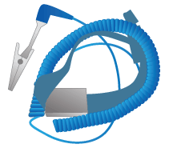

= Zusätzliche Ausrüstung und Tools (SG5700) erwerben
:allow-uri-read: 
:icons: font
:imagesdir: ../media/

[role="lead"]
Vergewissern Sie sich vor der Installation der StorageGRID Appliance, dass alle zusätzlichen Geräte und Tools zur Verfügung stehen, die Sie benötigen.

Sie benötigen die folgende zusätzliche Ausrüstung für die Installation und Konfiguration der Hardware:

* *Schraubendreher*
+
image::../media/screwdrivers.gif[Zwei Schraubendreher]

+
Phillips Nr. 2 Schraubendreher

+
Mittlerer Schlitzschraubendreher

* *ESD-Handgelenkschlaufe*
+

* *Optische Kabel und SFP-Transceiver*
+
image::../media/fc_cable_and_sfp.gif[Optisches Kabel und SFP+ Transceiver]

+
Optische Kabel für die 10/25-GbE-Ports, die Sie verwenden möchten

+
Optional: SFP28 Transceiver, wenn Sie 25-GbE-Verbindungsgeschwindigkeit verwenden möchten

* * Ethernet-Kabel*
+
image::../media/ethernet_cables.png[Ethernet-Kabel]

* *Service-Laptop*
+
image::../media/sam_management_client.gif[Service-Laptop]

+
xref:../admin/web-browser-requirements.adoc[Unterstützter Webbrowser]

+
SSH-Client, z. B. PuTTY

+
1-GB-Ethernet-Port (RJ-45)

* *Optionale Werkzeuge*
+
image::../media/optional_tools.gif[Kraftbohrer und Taschenlampe]

+
Kraftbohrer mit Kreuzschlitz

+
Taschenlampe

+
Mechanisierter Lift für SG5760

