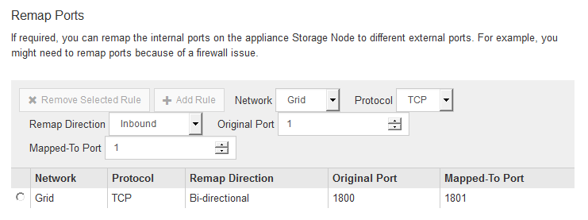

= Optional: Netzwerkports für Appliance neu zuordnen
:allow-uri-read: 
:icons: font
:imagesdir: ../media/

[role="lead"]
Möglicherweise müssen Sie die internen Ports auf dem Appliance Storage Node zu verschiedenen externen Ports neu zuordnen. Aufgrund eines Firewall-Problems müssen Sie möglicherweise Ports neu zuordnen.

.Was Sie benötigen
* Sie haben zuvor auf das Installationsprogramm für StorageGRID-Geräte zugegriffen.
* Sie sind nicht konfiguriert und planen keine Konfiguration von Load Balancer-Endpunkten.
+

IMPORTANT: Wenn Sie Ports neu zuordnen, können Sie nicht dieselben Ports zum Konfigurieren von Load Balancer-Endpunkten verwenden. Wenn Sie Endpunkte des Load Balancer konfigurieren und bereits Ports neu zugeordnet haben möchten, befolgen Sie die Schritte unter xref:../maintain/removing-port-remaps.adoc[Entfernen Sie die Port-Remaps].

.Schritte
. Klicken Sie in der Menüleiste des StorageGRID-Appliance-Installationsprogramms auf *Netzwerke konfigurieren* *Remap-Ports*.
+
Die Seite Remap Port wird angezeigt.

. Wählen Sie aus dem Dropdown-Feld *Netzwerk* das Netzwerk für den Port aus, den Sie neu zuordnen möchten: Grid, Administrator oder Client.
. Wählen Sie aus dem Dropdown-Feld *Protokoll* das IP-Protokoll TCP oder UDP aus.
. Wählen Sie aus dem Dropdown-Feld *Remap Direction* aus, welche Verkehrsrichtung Sie für diesen Port neu zuordnen möchten: Inbound, Outbound oder Bi-direktional.
. Geben Sie für *Original Port* die Nummer des Ports ein, den Sie neu zuordnen möchten.
. Geben Sie für den * Port zugeordnet* die Nummer des Ports ein, den Sie stattdessen verwenden möchten.
. Klicken Sie Auf *Regel Hinzufügen*.
+
Die neue Port-Zuordnung wird der Tabelle hinzugefügt, und die erneute Zuordnung wird sofort wirksam.

+

. Um eine Portzuordnung zu entfernen, aktivieren Sie das Optionsfeld für die Regel, die Sie entfernen möchten, und klicken Sie auf *Ausgewählte Regel entfernen*.

