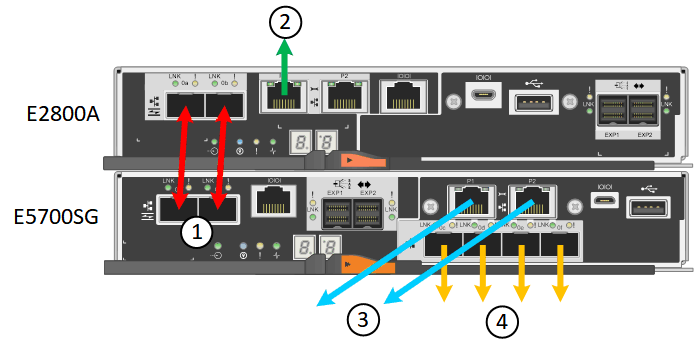

= Appliance-Netzwerkverbindungen (SG5700) prüfen
:allow-uri-read: 
:icons: font
:imagesdir: ../media/

[role="lead"]
Vor der Installation der StorageGRID Appliance sollten Sie wissen, welche Netzwerke mit der Appliance verbunden werden können und wie die Ports auf den einzelnen Controllern verwendet werden.

== StorageGRID Appliance-Netzwerke

Wenn Sie eine StorageGRID Appliance als Storage Node in einem StorageGRID Grid implementieren, können Sie sie mit folgenden Netzwerken verbinden:

* *Grid-Netzwerk für StorageGRID*: Das Grid-Netzwerk wird für den gesamten internen StorageGRID-Datenverkehr verwendet. Das System bietet Konnektivität zwischen allen Nodes im Grid und allen Standorten und Subnetzen. Das Grid-Netzwerk ist erforderlich.
* *Admin-Netzwerk für StorageGRID*: Das Admin-Netzwerk ist ein geschlossenes Netzwerk, das zur Systemadministration und Wartung verwendet wird. Das Admin-Netzwerk ist in der Regel ein privates Netzwerk und muss nicht zwischen Standorten routingfähig sein. Das Admin-Netzwerk ist optional.
* *Client-Netzwerk für StorageGRID:* das Client-Netzwerk ist ein offenes Netzwerk, das für den Zugriff auf Client-Anwendungen, einschließlich S3 und Swift, verwendet wird. Das Client-Netzwerk ermöglicht den Zugriff auf das Grid-Protokoll, sodass das Grid-Netzwerk isoliert und gesichert werden kann. Das Client-Netzwerk ist optional.
* *Managementnetzwerk für SANtricity System Manager* (optional): Dieses Netzwerk bietet Zugriff auf den SANtricity System Manager auf dem E2800 Controller, sodass Sie die Hardwarekomponenten der Appliance überwachen und verwalten können. Dieses Managementnetzwerk kann das gleiche sein wie das Admin-Netzwerk für StorageGRID, oder es kann ein unabhängiges Managementnetzwerk sein.
+
Wenn das optionale SANtricity System Manager-Netzwerk nicht verbunden ist, können Sie einige SANtricity-Funktionen möglicherweise nicht verwenden.

NOTE: Ausführliche Informationen zu StorageGRID-Netzwerken finden Sie unter _Rasterprimer_.

== Verbindungen zu StorageGRID-Appliances

Wenn Sie eine StorageGRID-Appliance installieren, müssen Sie die beiden Controller miteinander und mit den erforderlichen Netzwerken verbinden. Die Abbildung zeigt die beiden Controller der SG5760: Der E2800 Controller oben und der E5700SG Controller unten. In der SG5712 befindet sich der E2800 Controller links vom E5700SG Controller.

|===
|  | Port | Typ des Ports | Funktion 

 a| 
1
 a| 
Zwei Interconnect-Ports an jedem Controller
 a| 
16 Gbit/s FC optisch SFP+
 a| 
Verbinden Sie die beiden Controller miteinander.

 a| 
2
 a| 
Management-Port 1 am E2800-Controller
 a| 
1 GbE (RJ-45)
 a| 
Stellt eine Verbindung mit dem Netzwerk her, in dem Sie auf SANtricity System Manager zugreifen. Sie können das Admin-Netzwerk für StorageGRID oder ein unabhängiges Managementnetzwerk verwenden.

 a| 
2
 a| 
Management-Port 2 am E2800 Controller
 a| 
1 GbE (RJ-45)
 a| 
Reserviert für technischen Support.

 a| 
3
 a| 
Management-Port 1 am E5700SG Controller
 a| 
1 GbE (RJ-45)
 a| 
Verbindet den E5700SG-Controller mit dem Admin-Netzwerk für StorageGRID.

 a| 
3
 a| 
Management-Port 2 am E5700SG Controller
 a| 
1 GbE (RJ-45)
 a| 
* Kann mit Verwaltungsport 1 verbunden werden, wenn Sie eine redundante Verbindung zum Admin-Netzwerk wünschen.
* Kann unverkabelt und für temporären lokalen Zugang verfügbar sein (IP 169.254.0.1).
* Während der Installation kann verwendet werden, um den E5700SG-Controller mit einem Service-Laptop zu verbinden, wenn DHCP-zugewiesene IP-Adressen nicht verfügbar sind.

 a| 
4
 a| 
10/25-GbE-Ports 1-4 auf dem E5700SG Controller
 a| 
10-GbE oder 25-GbE

*Hinweis:* die im Lieferumfang des Geräts enthaltenen SFP+ Transceiver unterstützen 10-GbE-Verbindungsgeschwindigkeiten. Wenn Sie für die vier Netzwerk-Ports 25-GbE-Verbindungsgeschwindigkeiten verwenden möchten, müssen Sie SFP28-Transceiver bereitstellen.
 a| 
Stellen Sie eine Verbindung zum Grid-Netzwerk und dem Client-Netzwerk für StorageGRID her. Siehe „`10/25-GbE-Portverbindungen für den E5700SG Controller`“.

|===
.Verwandte Informationen
xref:gathering-installation-information-sg5700.adoc[Installationsinformationen (SG5700) erfassen]

xref:cabling-appliance-sg5700.adoc[Kabel-Appliance (SG5700)]

xref:port-bond-modes-for-e5700sg-controller-ports.adoc[Port Bond-Modi für E5700SG Controller-Ports]

xref:../network/index.adoc[Netzwerkrichtlinien]

xref:../vmware/index.adoc[VMware installieren]

xref:../rhel/index.adoc[Installieren Sie Red hat Enterprise Linux oder CentOS]

xref:../ubuntu/index.adoc[Installieren Sie Ubuntu oder Debian]
