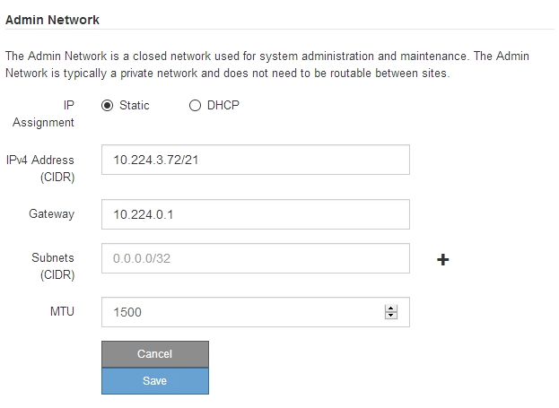

= Legen Sie die IP-Konfiguration fest
:allow-uri-read: 
:icons: font
:imagesdir: ../media/

[role="lead"]
Mit dem Installationsprogramm der StorageGRID-Appliance können Sie die für den Appliance-Speicherknoten verwendeten IP-Adressen und Routing-Informationen im StorageGRID-Raster, Administrator und Client-Netzwerke konfigurieren.

.Über diese Aufgabe
Sie müssen entweder auf jedem verbundenen Netzwerk eine statische IP-Adresse für das Gerät zuweisen oder einen permanenten Leasing für die Adresse des DHCP-Servers zuweisen.

Wenn Sie die Link-Konfiguration ändern möchten, lesen Sie die Anweisungen zum Ändern der Link-Konfiguration des E5700SG-Controllers.

.Schritte
. Wählen Sie im Installationsprogramm der StorageGRID-Appliance die Option *Netzwerke konfigurieren* *IP-Konfiguration* aus.
+
Die Seite IP-Konfiguration wird angezeigt.

. Um das Grid-Netzwerk zu konfigurieren, wählen Sie entweder *statisch* oder *DHCP* im Abschnitt *Grid Network* der Seite aus.
+
image::../media/grid_network_static.png[Grid-Netzwerk-IP]

. Wenn Sie *statisch* ausgewählt haben, führen Sie die folgenden Schritte aus, um das Grid-Netzwerk zu konfigurieren:
+
.. Geben Sie die statische IPv4-Adresse unter Verwendung von CIDR-Notation ein.
.. Geben Sie das Gateway ein.
+
Wenn Ihr Netzwerk kein Gateway aufweist, geben Sie die gleiche statische IPv4-Adresse erneut ein.

.. Wenn Sie Jumbo Frames verwenden möchten, ändern Sie das MTU-Feld in einen für Jumbo Frames geeigneten Wert, z. B. 9000. Behalten Sie andernfalls den Standardwert 1500 bei.
+

IMPORTANT: Der MTU-Wert des Netzwerks muss mit dem Wert übereinstimmen, der auf dem Switch-Port konfiguriert ist, mit dem der Node verbunden ist. Andernfalls können Probleme mit der Netzwerkleistung oder Paketverluste auftreten.

+

IMPORTANT: Für die beste Netzwerkleistung sollten alle Knoten auf ihren Grid Network Interfaces mit ähnlichen MTU-Werten konfiguriert werden. Die Warnung *Grid Network MTU mismatch* wird ausgelöst, wenn sich die MTU-Einstellungen für das Grid Network auf einzelnen Knoten erheblich unterscheiden. Die MTU-Werte müssen nicht für alle Netzwerktypen identisch sein.

.. Klicken Sie Auf *Speichern*.
+
Wenn Sie die IP-Adresse ändern, können sich auch das Gateway und die Liste der Subnetze ändern.

+
Wenn die Verbindung zum Installationsprogramm für StorageGRID-Geräte unterbrochen wird, geben Sie die URL mithilfe der neuen statischen IP-Adresse, die Sie gerade zugewiesen haben, erneut ein. Beispiel: +
`*https://_services_appliance_IP_:8443*`

.. Bestätigen Sie, dass die Liste der Grid Network Subnets korrekt ist.
+
Wenn Sie Grid-Subnetze haben, ist das Grid-Netzwerk-Gateway erforderlich. Alle angegebenen Grid-Subnetze müssen über dieses Gateway erreichbar sein. Diese Grid-Netzwerknetze müssen beim Starten der StorageGRID-Installation auch in der Netznetzwerksubnetz-Liste auf dem primären Admin-Node definiert werden.

+

NOTE: Die Standardroute wird nicht aufgeführt. Wenn das Client-Netzwerk nicht aktiviert ist, verwendet die Standardroute das Grid-Netzwerk-Gateway.

+
*** Um ein Subnetz hinzuzufügen, klicken Sie auf das Insert-Symbol image:../media/icon_plus_sign_black_on_white.gif["Symbol einfügen"] Rechts neben dem letzten Eintrag.
*** Um ein nicht verwendetes Subnetz zu entfernen, klicken Sie auf das Löschsymbol image:../media/icon_nms_delete_new.gif["Symbol Löschen"].

.. Klicken Sie Auf *Speichern*.

. Wenn Sie *DHCP* ausgewählt haben, führen Sie die folgenden Schritte aus, um das Grid-Netzwerk zu konfigurieren:
+
.. Nachdem Sie das Optionsfeld *DHCP* aktiviert haben, klicken Sie auf *Speichern*.
+
Die Felder *IPv4 Address*, *Gateway* und *Subnets* werden automatisch ausgefüllt. Wenn der DHCP-Server so konfiguriert ist, dass er einen MTU-Wert zuweist, wird das Feld *MTU* mit diesem Wert ausgefüllt, und das Feld ist schreibgeschützt.

+
Ihr Webbrowser wird automatisch an die neue IP-Adresse für das StorageGRID-Appliance-Installationsprogramm umgeleitet.

.. Bestätigen Sie, dass die Liste der Grid Network Subnets korrekt ist.
+
Wenn Sie Grid-Subnetze haben, ist das Grid-Netzwerk-Gateway erforderlich. Alle angegebenen Grid-Subnetze müssen über dieses Gateway erreichbar sein. Diese Grid-Netzwerknetze müssen beim Starten der StorageGRID-Installation auch in der Netznetzwerksubnetz-Liste auf dem primären Admin-Node definiert werden.

+

NOTE: Die Standardroute wird nicht aufgeführt. Wenn das Client-Netzwerk nicht aktiviert ist, verwendet die Standardroute das Grid-Netzwerk-Gateway.

+
*** Um ein Subnetz hinzuzufügen, klicken Sie auf das Insert-Symbol image:../media/icon_plus_sign_black_on_white.gif["Symbol einfügen"] Rechts neben dem letzten Eintrag.
*** Um ein nicht verwendetes Subnetz zu entfernen, klicken Sie auf das Löschsymbol image:../media/icon_nms_delete_new.gif["Symbol Löschen"].

.. Wenn Sie Jumbo Frames verwenden möchten, ändern Sie das MTU-Feld in einen für Jumbo Frames geeigneten Wert, z. B. 9000. Behalten Sie andernfalls den Standardwert 1500 bei.
+

IMPORTANT: Der MTU-Wert des Netzwerks muss mit dem Wert übereinstimmen, der auf dem Switch-Port konfiguriert ist, mit dem der Node verbunden ist. Andernfalls können Probleme mit der Netzwerkleistung oder Paketverluste auftreten.

+

IMPORTANT: Für die beste Netzwerkleistung sollten alle Knoten auf ihren Grid Network Interfaces mit ähnlichen MTU-Werten konfiguriert werden. Die Warnung *Grid Network MTU mismatch* wird ausgelöst, wenn sich die MTU-Einstellungen für das Grid Network auf einzelnen Knoten erheblich unterscheiden. Die MTU-Werte müssen nicht für alle Netzwerktypen identisch sein.

.. Klicken Sie Auf *Speichern*.

. Um das Admin-Netzwerk zu konfigurieren, wählen Sie im Abschnitt Admin-Netzwerk der Seite entweder *statisch* oder *DHCP* aus.
+

NOTE: Um das Admin-Netzwerk zu konfigurieren, müssen Sie das Admin-Netzwerk auf der Seite Link Configuration aktivieren.

+

. Wenn Sie *statisch* ausgewählt haben, führen Sie die folgenden Schritte aus, um das Admin-Netzwerk zu konfigurieren:
+
.. Geben Sie die statische IPv4-Adresse mit CIDR-Schreibweise für Management-Port 1 auf dem Gerät ein.
+
Management-Port 1 befindet sich links von den beiden 1-GbE-RJ45-Ports am rechten Ende der Appliance.

.. Geben Sie das Gateway ein.
+
Wenn Ihr Netzwerk kein Gateway aufweist, geben Sie die gleiche statische IPv4-Adresse erneut ein.

.. Wenn Sie Jumbo Frames verwenden möchten, ändern Sie das MTU-Feld in einen für Jumbo Frames geeigneten Wert, z. B. 9000. Behalten Sie andernfalls den Standardwert 1500 bei.
+

IMPORTANT: Der MTU-Wert des Netzwerks muss mit dem Wert übereinstimmen, der auf dem Switch-Port konfiguriert ist, mit dem der Node verbunden ist. Andernfalls können Probleme mit der Netzwerkleistung oder Paketverluste auftreten.

.. Klicken Sie Auf *Speichern*.
+
Wenn Sie die IP-Adresse ändern, können sich auch das Gateway und die Liste der Subnetze ändern.

+
Wenn die Verbindung zum Installationsprogramm für StorageGRID-Geräte unterbrochen wird, geben Sie die URL mithilfe der neuen statischen IP-Adresse, die Sie gerade zugewiesen haben, erneut ein. Beispiel: +
`*https://_services_appliance_:8443*`

.. Bestätigen Sie, dass die Liste der Admin-Netzwerk-Subnetze korrekt ist.
+
Sie müssen überprüfen, ob alle Subnetze über das von Ihnen angegebene Gateway erreicht werden können.

+

NOTE: Die Standardroute kann nicht zur Verwendung des Admin-Netzwerk-Gateways verwendet werden.

+
*** Um ein Subnetz hinzuzufügen, klicken Sie auf das Insert-Symbol image:../media/icon_plus_sign_black_on_white.gif["Symbol einfügen"] Rechts neben dem letzten Eintrag.
*** Um ein nicht verwendetes Subnetz zu entfernen, klicken Sie auf das Löschsymbol image:../media/icon_nms_delete_new.gif["Symbol Löschen"].

.. Klicken Sie Auf *Speichern*.

. Wenn Sie *DHCP* ausgewählt haben, führen Sie die folgenden Schritte aus, um das Admin-Netzwerk zu konfigurieren:
+
.. Nachdem Sie das Optionsfeld *DHCP* aktiviert haben, klicken Sie auf *Speichern*.
+
Die Felder *IPv4 Address*, *Gateway* und *Subnets* werden automatisch ausgefüllt. Wenn der DHCP-Server so konfiguriert ist, dass er einen MTU-Wert zuweist, wird das Feld *MTU* mit diesem Wert ausgefüllt, und das Feld ist schreibgeschützt.

+
Ihr Webbrowser wird automatisch an die neue IP-Adresse für das StorageGRID-Appliance-Installationsprogramm umgeleitet.

.. Bestätigen Sie, dass die Liste der Admin-Netzwerk-Subnetze korrekt ist.
+
Sie müssen überprüfen, ob alle Subnetze über das von Ihnen angegebene Gateway erreicht werden können.

+

NOTE: Die Standardroute kann nicht zur Verwendung des Admin-Netzwerk-Gateways verwendet werden.

+
*** Um ein Subnetz hinzuzufügen, klicken Sie auf das Insert-Symbol image:../media/icon_plus_sign_black_on_white.gif["Symbol einfügen"] Rechts neben dem letzten Eintrag.
*** Um ein nicht verwendetes Subnetz zu entfernen, klicken Sie auf das Löschsymbol image:../media/icon_nms_delete_new.gif["Symbol Löschen"].

.. Wenn Sie Jumbo Frames verwenden möchten, ändern Sie das MTU-Feld in einen für Jumbo Frames geeigneten Wert, z. B. 9000. Behalten Sie andernfalls den Standardwert 1500 bei.
+

IMPORTANT: Der MTU-Wert des Netzwerks muss mit dem Wert übereinstimmen, der auf dem Switch-Port konfiguriert ist, mit dem der Node verbunden ist. Andernfalls können Probleme mit der Netzwerkleistung oder Paketverluste auftreten.

.. Klicken Sie Auf *Speichern*.

. Um das Client-Netzwerk zu konfigurieren, wählen Sie entweder *statisch* oder *DHCP* im Abschnitt *Client-Netzwerk* der Seite aus.
+

NOTE: Um das Client-Netzwerk zu konfigurieren, müssen Sie das Client-Netzwerk auf der Seite Link Configuration aktivieren.

+
image::../media/client_network_static.png[Client-Netzwerk-IP]

. Wenn Sie *statisch* ausgewählt haben, führen Sie die folgenden Schritte aus, um das Client-Netzwerk zu konfigurieren:
+
.. Geben Sie die statische IPv4-Adresse unter Verwendung von CIDR-Notation ein.
.. Klicken Sie Auf *Speichern*.
.. Vergewissern Sie sich, dass die IP-Adresse für das Client-Netzwerk-Gateway korrekt ist.
+

NOTE: Wenn das Client-Netzwerk aktiviert ist, wird die Standardroute angezeigt. Die Standardroute verwendet das Client-Netzwerk-Gateway und kann nicht auf eine andere Schnittstelle verschoben werden, während das Client-Netzwerk aktiviert ist.

.. Wenn Sie Jumbo Frames verwenden möchten, ändern Sie das MTU-Feld in einen für Jumbo Frames geeigneten Wert, z. B. 9000. Behalten Sie andernfalls den Standardwert 1500 bei.
+

IMPORTANT: Der MTU-Wert des Netzwerks muss mit dem Wert übereinstimmen, der auf dem Switch-Port konfiguriert ist, mit dem der Node verbunden ist. Andernfalls können Probleme mit der Netzwerkleistung oder Paketverluste auftreten.

.. Klicken Sie Auf *Speichern*.

. Wenn Sie *DHCP* ausgewählt haben, führen Sie die folgenden Schritte aus, um das Client-Netzwerk zu konfigurieren:
+
.. Nachdem Sie das Optionsfeld *DHCP* aktiviert haben, klicken Sie auf *Speichern*.
+
Die Felder *IPv4 Address* und *Gateway* werden automatisch ausgefüllt. Wenn der DHCP-Server so konfiguriert ist, dass er einen MTU-Wert zuweist, wird das Feld *MTU* mit diesem Wert ausgefüllt, und das Feld ist schreibgeschützt.

+
Ihr Webbrowser wird automatisch an die neue IP-Adresse für das StorageGRID-Appliance-Installationsprogramm umgeleitet.

.. Vergewissern Sie sich, dass das Gateway korrekt ist.
+

NOTE: Wenn das Client-Netzwerk aktiviert ist, wird die Standardroute angezeigt. Die Standardroute verwendet das Client-Netzwerk-Gateway und kann nicht auf eine andere Schnittstelle verschoben werden, während das Client-Netzwerk aktiviert ist.

.. Wenn Sie Jumbo Frames verwenden möchten, ändern Sie das MTU-Feld in einen für Jumbo Frames geeigneten Wert, z. B. 9000. Behalten Sie andernfalls den Standardwert 1500 bei.
+

IMPORTANT: Der MTU-Wert des Netzwerks muss mit dem Wert übereinstimmen, der auf dem Switch-Port konfiguriert ist, mit dem der Node verbunden ist. Andernfalls können Probleme mit der Netzwerkleistung oder Paketverluste auftreten.

.Verwandte Informationen
xref:changing-link-configuration-of-e5700sg-controller.adoc[Ändern Sie die Link-Konfiguration des E5700SG Controllers]
