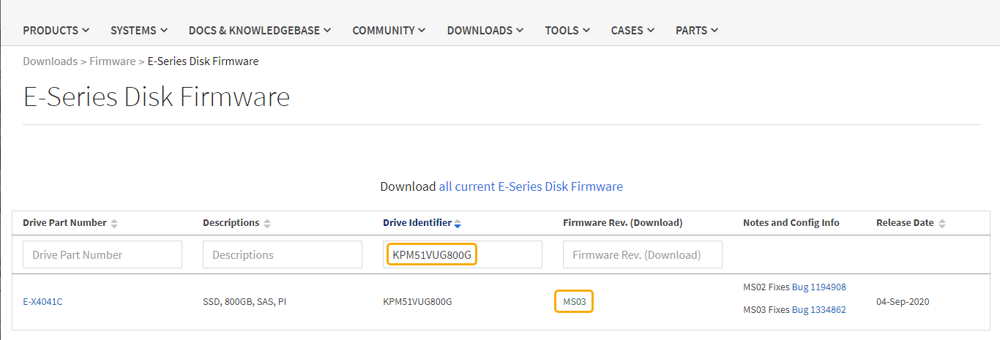

= Aktualisieren Sie die Laufwerk-Firmware mit SANtricity System Manager
:allow-uri-read: 
:icons: font
:imagesdir: ../media/

[role="lead"]
Sie aktualisieren Ihre Laufwerk-Firmware, um sicherzustellen, dass Sie über alle neuesten Funktionen und Fehlerbehebungen verfügen.

.Was Sie und#8217;ll benötigen
* Die Storage Appliance hat einen optimalen Status.
* Alle Laufwerke haben einen optimalen Status.
* Die aktuelle Version von SANtricity System Manager ist mit Ihrer StorageGRID-Version kompatibel.
* Das ist schon xref:placing-appliance-into-maintenance-mode.adoc[StorageGRID-Appliance in den Wartungsmodus versetzt].
+

NOTE: Im Wartungsmodus wird die Verbindung zum Storage Controller unterbrochen, alle I/O-Aktivitäten werden angehalten und alle Laufwerke werden offline geschaltet.

+

IMPORTANT: Aktualisieren Sie die Laufwerk-Firmware nicht auf mehr als einer StorageGRID Appliance gleichzeitig. Dadurch kann je nach Implementierungsmodell und ILM-Richtlinien die Nichtverfügbarkeit von Daten auftreten.

.Schritte
. Vergewissern Sie sich, dass das Gerät in ist xref:placing-appliance-into-maintenance-mode.adoc[Wartungsmodus].
. Greifen Sie mit einer der folgenden Methoden auf SANtricity System Manager zu:
+
** Verwenden Sie den StorageGRID-Appliance-Installer und wählen Sie *Erweitert* *SANtricity-Systemmanager* aus
** Verwenden Sie SANtricity System Manager, indem Sie die Storage Controller-IP verwenden: +
`*https://_Storage_Controller_IP_*`

. Geben Sie bei Bedarf den Benutzernamen und das Kennwort des SANtricity System Manager-Administrators ein.
. Überprüfen Sie die Version der Laufwerk-Firmware, die derzeit in der Speicher-Appliance installiert ist:
+
.. Wählen Sie im SANtricity System Manager *SUPPORT* *Upgrade Center* aus.
.. Wählen Sie unter Laufwerk-Firmware-Upgrade die Option *Upgrade starten* aus.
+
Auf der Upgrade Drive Firmware werden die zurzeit installierten Firmware-Dateien des Laufwerks angezeigt.

.. Beachten Sie die aktuellen Versionen der Laufwerk-Firmware und die Laufwerkskennungen in der Spalte Aktueller Laufwerk-Firmware.
+
image::../media/storagegrid_update_drive_firmware.png[Aktualisieren Sie Die Laufwerk-Firmware]

+
In diesem Beispiel:

+
*** Die Version der Laufwerk-Firmware lautet *MS02*.
*** Die Laufwerk-ID lautet *KPM51VUG800G*.

+
Wählen Sie in der Spalte „verbundene Laufwerke“ die Option *Laufwerke anzeigen* aus, um anzuzeigen, wo diese Laufwerke in Ihrem Speichergerät installiert sind.

.. Schließen Sie das Fenster Upgrade Drive Firmware.

. Laden Sie das verfügbare Laufwerk-Firmware-Upgrade herunter, und bereiten Sie es vor:
+
.. Wählen Sie unter Laufwerk-Firmware-Upgrade *NetApp Support* aus.
.. Wählen Sie auf der NetApp Support Website die Registerkarte *Downloads* aus und wählen Sie dann *E-Series Festplatten-Firmware* aus.
+
Die Seite E-Series Festplatten-Firmware wird angezeigt.

.. Suchen Sie nach jedem in Ihrer Speicheranwendung installierten *Drive Identifier*, und stellen Sie sicher, dass jeder Laufwerkkennung die neueste Firmware-Version hat.
+
*** Wenn die Firmware-Version kein Link ist, hat diese Laufwerkkennung die neueste Firmware-Version.
*** Wenn eine oder mehrere Laufwerk-Teilenummern für eine Laufwerksidentifikation aufgeführt sind, ist für diese Laufwerke ein Firmware-Upgrade verfügbar. Sie können einen beliebigen Link auswählen, um die Firmware-Datei herunterzuladen.
+

.. Wenn eine spätere Firmware-Version aufgeführt wird, wählen Sie den Link im Firmware-Rev. Aus (Download) Spalte zum Herunterladen einer `.zip` Archiv mit der Firmware-Datei.
.. Extrahieren Sie die von der Support-Website heruntergeladenen Archivdateien der Laufwerk-Firmware (entpacken).

. Installieren Sie das Laufwerk-Firmware-Upgrade:
+
.. Wählen Sie im SANtricity System Manager unter Upgrade der Laufwerk-Firmware die Option *Upgrade starten* aus.
.. Wählen Sie *Durchsuchen* aus, und wählen Sie die neuen Laufwerk-Firmware-Dateien aus, die Sie von der Support-Website heruntergeladen haben.
+
Die Firmware-Dateien des Laufwerks haben einen Dateinamen wie + `D_HUC101212CSS600_30602291_MS01_2800_0002.dlp`

+
Sie können bis zu vier Laufwerk-Firmware-Dateien auswählen, jeweils eine. Wenn mehrere Firmware-Dateien eines Laufwerks mit demselben Laufwerk kompatibel sind, wird ein Dateikonflikt angezeigt. Legen Sie fest, welche Laufwerk-Firmware-Datei Sie für das Upgrade verwenden möchten, und entfernen Sie die andere.

.. Wählen Sie *Weiter*.
+
*Select Drives* listet die Laufwerke auf, die Sie mit den ausgewählten Firmware-Dateien aktualisieren können.

+
Es werden nur kompatible Laufwerke angezeigt.

+
Die ausgewählte Firmware für das Laufwerk wird in *vorgeschlagene Firmware* angezeigt. Wenn Sie diese Firmware ändern müssen, wählen Sie *Zurück*.

.. Wählen Sie * Offline (Parallel)* Upgrade.
+
Sie können die Offline-Upgrade-Methode verwenden, weil sich die Appliance im Wartungsmodus befindet, wobei I/O-Aktivitäten für alle Laufwerke und alle Volumes angehalten werden.

+

CAUTION: Fahren Sie nur dann fort, wenn Sie sich sicher sind, dass sich das Gerät im Wartungsmodus befindet. Wenn die Appliance nicht in den Wartungsmodus versetzt wird, bevor ein Offline-Update der Laufwerk-Firmware gestartet wird, kann dies zu Datenverlust führen.

.. Wählen Sie in der ersten Spalte der Tabelle das Laufwerk oder die Laufwerke aus, die aktualisiert werden sollen.
+
Als Best Practice wird empfohlen, alle Laufwerke desselben Modells auf dieselbe Firmware-Version zu aktualisieren.

.. Wählen Sie *Start*, und bestätigen Sie, dass Sie das Upgrade durchführen möchten.
+
Wenn Sie das Upgrade beenden möchten, wählen Sie *Stopp*. Alle derzeit ausgeführten Firmware-Downloads abgeschlossen. Alle nicht gestarteten Firmware-Downloads werden abgebrochen.

+

IMPORTANT: Das Anhalten der Laufwerk-Firmware-Aktualisierung kann zu Datenverlust oder nicht verfügbaren Laufwerken führen.

.. (Optional) um eine Liste der aktualisierten Versionen anzuzeigen, wählen Sie *Protokoll speichern*.
+
Die Protokolldatei wird im Download-Ordner für Ihren Browser mit dem Namen gespeichert `latest-upgrade-log-timestamp.txt`.

+
Wenn während des Aktualisierungsvorgangs eines der folgenden Fehler auftritt, ergreifen Sie die entsprechende empfohlene Maßnahme.

+
*** *Fehlgeschlagene zugewiesene Laufwerke*
+
Ein Grund für den Fehler könnte sein, dass das Laufwerk nicht über die entsprechende Signatur verfügt. Stellen Sie sicher, dass es sich bei dem betroffenen Laufwerk um ein autorisiertes Laufwerk handelt. Weitere Informationen erhalten Sie vom technischen Support.

+
Stellen Sie beim Austausch eines Laufwerks sicher, dass das Ersatzlaufwerk eine Kapazität hat, die der des ausgefallenen Laufwerks entspricht oder größer ist als das ausgefallene Laufwerk, das Sie ersetzen.

+
Sie können das ausgefallene Laufwerk ersetzen, während das Speicher-Array I/O-Vorgänge erhält

*** *Speicher-Array prüfen*
+
**** Stellen Sie sicher, dass jedem Controller eine IP-Adresse zugewiesen wurde.
**** Stellen Sie sicher, dass alle an den Controller angeschlossenen Kabel nicht beschädigt sind.
**** Stellen Sie sicher, dass alle Kabel fest angeschlossen sind.

*** * Integrierte Hot-Spare-Laufwerke*
+
Diese Fehlerbedingung muss korrigiert werden, bevor Sie die Firmware aktualisieren können.

*** *Unvollständige Volume-Gruppen*
+
Wenn eine oder mehrere Volume-Gruppen oder Disk Pools unvollständig sind, müssen Sie diese Fehlerbedingung korrigieren, bevor Sie die Firmware aktualisieren können.

*** *Exklusive Operationen (außer Hintergrund-Medien/Paritäts-Scan), die derzeit auf beliebigen Volume-Gruppen* ausgeführt werden
+
Wenn ein oder mehrere exklusive Vorgänge ausgeführt werden, müssen die Vorgänge abgeschlossen sein, bevor die Firmware aktualisiert werden kann. Überwachen Sie den Fortschritt des Betriebs mit System Manager.

*** *Fehlende Volumen*
+
Sie müssen den fehlenden Datenträgerzustand korrigieren, bevor die Firmware aktualisiert werden kann.

*** *Entweder Controller in einem anderen Zustand als optimal*
+
Einer der Controller des Storage Arrays muss Aufmerksamkeit schenken. Diese Bedingung muss korrigiert werden, bevor die Firmware aktualisiert werden kann.

*** *Unpassende Speicherpartitionsdaten zwischen Controller-Objektgrafiken*
+
Beim Validieren der Daten auf den Controllern ist ein Fehler aufgetreten. Wenden Sie sich an den technischen Support, um dieses Problem zu lösen.

*** *SPM Überprüfung des Datenbankcontrollers schlägt fehl*
+
Auf einem Controller ist ein Fehler bei der Zuordnung von Speicherpartitionen zur Datenbank aufgetreten. Wenden Sie sich an den technischen Support, um dieses Problem zu lösen.

*** *Überprüfung der Konfigurationsdatenbank (sofern von der Controller-Version des Speicherarrays unterstützt)*
+
Auf einem Controller ist ein Fehler in der Konfigurationsdatenbank aufgetreten. Wenden Sie sich an den technischen Support, um dieses Problem zu lösen.

*** *MEL-bezogene Prüfungen*
+
Wenden Sie sich an den technischen Support, um dieses Problem zu lösen.

*** *In den letzten 7 Tagen wurden mehr als 10 DDE Informations- oder kritische MEL-Ereignisse gemeldet*
+
Wenden Sie sich an den technischen Support, um dieses Problem zu lösen.

*** *Mehr als 2 Seiten 2C kritische MEL-Ereignisse wurden in den letzten 7 Tagen* gemeldet
+
Wenden Sie sich an den technischen Support, um dieses Problem zu lösen.

*** *In den letzten 7 Tagen wurden mehr als 2 heruntergestuften Drive Channel-kritische MEL-Ereignisse gemeldet*
+
Wenden Sie sich an den technischen Support, um dieses Problem zu lösen.

*** *Mehr als 4 kritische MEL-Einträge in den letzten 7 Tagen*
+
Wenden Sie sich an den technischen Support, um dieses Problem zu lösen.

. . Wenn diese Prozedur erfolgreich abgeschlossen ist und Sie weitere durchzuführenden Verfahren haben, während sich der Node im Wartungsmodus befindet, führen Sie sie jetzt aus. Wenn Sie fertig sind oder Fehler auftreten und von vorne beginnen möchten, wählen Sie *Erweitert* *Controller neu starten* aus, und wählen Sie dann eine der folgenden Optionen aus:
+
** Wählen Sie *Neustart in StorageGRID* aus
** Wählen Sie *Neustart im Wartungsmodus* aus, um den Controller neu zu starten, wobei der Knoten noch im Wartungsmodus bleibt. Wählen Sie diese Option aus, wenn während des Verfahrens Fehler auftreten und neu starten möchten. Nachdem der Node das Neubooten in den Wartungsmodus abgeschlossen hat, starten Sie den entsprechenden Schritt während des ausgefallenen Verfahrens neu.
+
image::../media/reboot_controller_from_maintenance_mode.png[Booten Sie den Controller im Wartungsmodus neu]

+
Die Appliance kann bis zu 20 Minuten dauern, bis sie neu gestartet und wieder in das Grid eingesetzt wird. Um zu überprüfen, ob das Neubooten abgeschlossen ist und dass der Node wieder dem Grid beigetreten ist, gehen Sie zurück zum Grid Manager. Auf der Seite Knoten sollte ein normaler Status (links neben dem Knotennamen keine Symbole) für den Appliance-Knoten angezeigt werden, der angibt, dass keine Warnmeldungen aktiv sind und der Knoten mit dem Raster verbunden ist.

+
image::../media/node_rejoin_grid_confirmation.png[Das Raster des Appliance-Node wurde neu verbunden]

xref:upgrading-santricity-os-on-storage-controller.adoc[Aktualisieren Sie das SANtricity OS auf dem Storage Controller]
