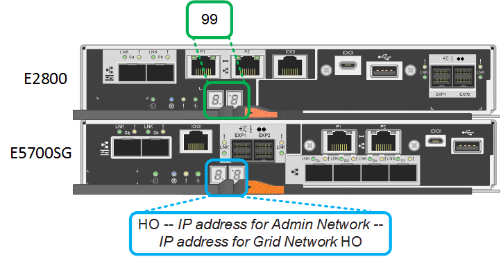

= Zeigt die SG5700-Boot-Statuscodes an
:allow-uri-read: 
:icons: font
:imagesdir: ../media/

[role="lead"]
Die sieben-Segment-Anzeigen auf jedem Controller zeigen Status- und Fehlercodes an, wenn das Gerät eingeschaltet wird.

.Über diese Aufgabe
Der E2800 Controller und der E5700SG Controller zeigen verschiedene Status und Fehlercodes an.

Um zu verstehen, was diese Codes bedeuten, lesen Sie die folgenden Ressourcen:

|===
| Controller | Referenz 

 a| 
E2800 Controller
 a| 
_E5700 and E2800 System Monitoring Guide_

*Hinweis:* die für den E-Series E5700 Controller aufgeführten Codes gelten nicht für den E5700SG Controller in der Appliance.

 a| 
E5700SG Controller
 a| 
„`status-Indikatoren am E5700SG-Controller`“

|===
.Schritte
. Überwachen Sie während des Startvorgangs den Fortschritt, indem Sie die Codes auf den sieben Segmentanzeigen anzeigen.
+
** Das 7-Segment-Display auf dem E2800-Controller zeigt die sich wiederholende Sequenz *OS*, *SD*, `*_blank_*` Um anzugeben, dass es die Tagesbeginn-Verarbeitung durchführt.
** Das 7-Segment-Display des E5700SG-Reglers zeigt eine Sequenz von Codes an, die mit *AA* und *FF* enden.

. Bestätigen Sie, dass die sieben-Segment-Anzeigen nach dem Booten der Controller Folgendes anzeigen:
+

+
|===
| Controller | Sieben-Segment-Anzeige 

 a| 
E2800 Controller
 a| 
Zeigt 99. Dies ist die Standard-ID für ein E-Series Controller-Shelf.

 a| 
E5700SG Controller
 a| 
Zeigt *HO*, gefolgt von einer sich wiederholenden Sequenz von zwei Zahlen.

[listing]
----
HO -- IP address for Admin Network -- IP address for Grid Network HO
----
In der Sequenz ist der erste Zahlensatz die IP-Adresse, die vom DHCP für den Management-Port 1 des Controllers zugewiesen wird. Diese Adresse wird verwendet, um den Controller mit dem Admin-Netzwerk für StorageGRID zu verbinden. Die zweite Zahlengruppe ist die durch DHCP zugewiesene IP-Adresse, die zur Verbindung des Geräts mit dem Grid Network for StorageGRID verwendet wird.

*Hinweis:* konnte eine IP-Adresse nicht über DHCP zugewiesen werden, wird 0.0.0.0 angezeigt.

|===
. Wenn die sieben Segmente andere Werte anzeigen, siehe xref:troubleshooting-hardware-installation.adoc[Fehlerbehebung bei der Hardware-Installation (SG5700)] Und bestätigen Sie, dass Sie die Installationsschritte korrekt ausgeführt haben. Wenn das Problem nicht behoben werden kann, wenden Sie sich an den technischen Support.

.Verwandte Informationen
xref:status-indicators-on-e5700sg-controller.adoc[Statusanzeigen auf dem E5700SG-Controller]

https://library.netapp.com/ecmdocs/ECMLP2588751/html/frameset.html["E5700 und E2800 – System Monitoring Guide"^]
