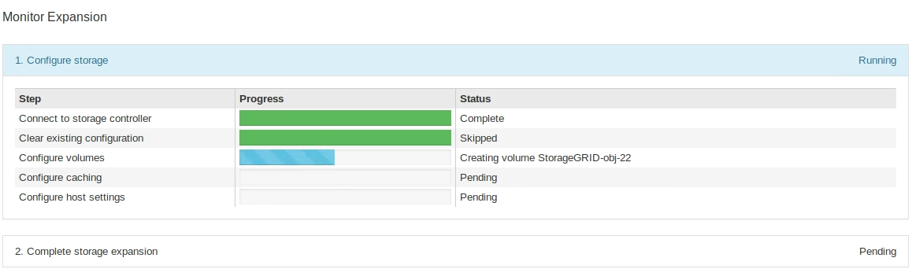

= Erweiterungs-Shelf für das implementierte SG6060 hinzufügen
:allow-uri-read: 
:icons: font
:imagesdir: ../media/

[role="lead"]
Zur Erhöhung der Storage-Kapazität können ein oder zwei Erweiterungs-Shelfs zu einem SG6060 oder SG6060X hinzugefügt werden, das bereits in einem StorageGRID System implementiert ist.

.Was Sie und#8217;ll benötigen
* Sie müssen über eine Passphrase für die Bereitstellung verfügen.
* Sie müssen StorageGRID 11.4 oder höher ausführen.
* Sie haben das Erweiterungs-Shelf und zwei SAS-Kabel für jedes Erweiterungs-Shelf.
* Dort befinden sich die Storage Appliance physisch, wo das Erweiterungs-Shelf im Datacenter hinzugefügt wird.
+
xref:locating-controller-in-data-center.adoc[Controller im Datacenter finden]

Um ein Erweiterungs-Shelf hinzuzufügen, führen Sie die folgenden grundlegenden Schritte aus:

* Installieren Sie die Hardware in den Schrank oder Rack.
* Platzieren Sie das SG6060 oder SG6060X in den Wartungsmodus.
* Verbinden Sie das Erweiterungs-Shelf mit dem E2860 Controller-Shelf oder mit einem anderen Erweiterungs-Shelf.
* Starten Sie die Erweiterung mithilfe des StorageGRID-Appliance-Installationsprogramms
* Warten Sie, bis die neuen Volumes konfiguriert sind.

Das Abschließen des Vorgangs für ein oder zwei Erweiterungs-Shelfs sollte eine Stunde oder weniger pro Appliance-Node dauern. Zur Minimierung von Ausfallzeiten werden Sie in den folgenden Schritten aufgefordert, die neuen Erweiterungs-Shelfs und Laufwerke zu installieren, bevor Sie den SG6060 oder SG6060X in den Wartungsmodus versetzen. Die verbleibenden Schritte sollten etwa 20 bis 30 Minuten pro Appliance-Node in Anspruch nehmen.

.Schritte
. Befolgen Sie die Anweisungen, um Shelfs mit 60 Laufwerken in einem Schrank oder Rack zu installieren.
+
xref:sg6060-installing-60-drive-shelves-into-cabinet-or-rack.adoc[SG6060 und SG6060X: Shelfs mit 60 Laufwerken in einem Rack oder Rack installieren]

. Befolgen Sie die Anweisungen zur Installation der Laufwerke.
+
xref:sg6060-installing-drives.adoc[SG6060 und SG6060X: Installieren von Laufwerken]

. Vom Grid Manager xref:placing-appliance-into-maintenance-mode.adoc[Versetzen Sie den SG6000-CN Controller in den Wartungsmodus].
. Verbinden Sie jedes Erweiterungs-Shelf mit dem E2860 Controller-Shelf, wie in der Abbildung dargestellt.
+
Diese Zeichnung zeigt zwei Erweiterungs-Shelfs. Wenn nur einer vorhanden ist, verbinden Sie IOM A mit Controller A und verbinden Sie IOM B mit Controller B

+

NOTE: SG6060 wird angezeigt. Die Erweiterungskabel für das SG6060X sind identisch.

+
image::../media/expansion_shelves_connections_sg6060.png[SG6060 Erweiterungs-Shelf-Verbindungen]

+
|===
| Legende | Beschreibung 

 a| 
1
 a| 
SG6000-CN

 a| 
2
 a| 
E2860 Controller-Shelf

 a| 
3
 a| 
Controller A

 a| 
4
 a| 
Controller B

 a| 
5
 a| 
Erweiterungs-Shelf 1

 a| 
6
 a| 
IOM A für Erweiterungs-Shelf 1

 a| 
7
 a| 
IOM B für Erweiterungs-Shelf 1

 a| 
8
 a| 
Erweiterungs-Shelf 2

 a| 
9
 a| 
IOM A für Erweiterungs-Shelf 2

 a| 
10
 a| 
IOM B für Erweiterungs-Shelf 2

|===
. Schließen Sie die Stromkabel an, und setzen Sie Strom auf die Erweiterungs-Shelves.
+
.. Schließen Sie ein Netzkabel an jede der beiden Netzteile in jedem Erweiterungs-Shelf an.
.. Verbinden Sie die beiden Netzkabel jedes Erweiterungs-Shelf mit zwei verschiedenen PDUs im Schrank oder Rack.
.. Schalten Sie die beiden Netzschalter für jedes Erweiterungs-Shelf ein.
+
*** Schalten Sie die Netzschalter während des Einschaltvorgangs nicht aus.
*** Die Lüfter in den Erweiterungsregalen sind beim ersten Start möglicherweise sehr laut. Das laute Geräusch beim Anfahren ist normal.

. Überwachen Sie die Startseite des Installationsprogramms für StorageGRID-Geräte.
+
Die Erweiterungs-Shelfs wurden in etwa fünf Minuten eingeschaltet und vom System erkannt. Auf der Startseite wird die Anzahl der neu erkannten Erweiterungs-Shelves angezeigt, und die Schaltfläche Expansion starten ist aktiviert.

+
Der Screenshot zeigt Beispiele für Meldungen, die auf der Startseite angezeigt werden können, je nach Anzahl der vorhandenen oder neuen Erweiterungs-Shelfs, wie folgt:

+
** Das oben auf der Seite eingekreiste Banner zeigt die Gesamtzahl der erkannten Erweiterungs-Shelfs an.
+
*** Das Banner zeigt die Gesamtzahl der Erweiterungs-Shelfs an, unabhängig davon, ob die Shelfs konfiguriert und implementiert oder neu und nicht konfiguriert sind.
*** Wenn keine Erweiterungs-Shelfs erkannt werden, wird das Banner nicht angezeigt.

** Die Nachricht, die unten auf der Seite eingekreist wurde, zeigt an, dass eine Erweiterung bereit ist, gestartet zu werden.
+
*** Die Meldung gibt die Anzahl der neu erkannten Erweiterungs-Shelfs StorageGRID an. „`Attached`“ gibt an, dass das Shelf erkannt wird. „`Unconfigured`“ gibt an, dass das Shelf neu und noch nicht mit dem Installationsprogramm für StorageGRID Appliance konfiguriert ist.
+

NOTE: Bereits implementierte Erweiterungs-Shelfs sind in dieser Meldung nicht enthalten. Sie werden in die Zählung in das Banner oben auf der Seite aufgenommen.

*** Die Meldung wird nicht angezeigt, wenn neue Erweiterungs-Shelfs nicht erkannt werden.
+
image::../media/appl_installer_home_expansion_shelf_ready_to_install.png[Installation Von Erweiterungs-Shelf]

. Lösen Sie bei Bedarf alle in den Meldungen auf der Startseite beschriebenen Probleme.
+
Verwenden Sie beispielsweise den SANtricity System Manager, um alle Probleme mit der Storage-Hardware zu beheben.

. Überprüfen Sie, ob die Anzahl der auf der Startseite angezeigten Erweiterungs-Shelfs mit der Anzahl der hinzuzufügenden Erweiterungs-Shelfs übereinstimmt.
+

NOTE: Wenn die neuen Erweiterungs-Shelfs nicht erkannt wurden, überprüfen Sie, ob sie ordnungsgemäß verkabelt und eingeschaltet sind.

. [[Start_Expansion]]Klicken Sie auf *Erweiterung starten*, um die Erweiterungs-Shelfs zu konfigurieren und für den Objekt-Storage verfügbar zu machen.
. Überwachen Sie den Fortschritt der Erweiterungs-Shelf-Konfiguration.
+
Fortschrittsbalken werden auf der Webseite angezeigt, genau wie bei der Erstinstallation.

+

+
Nach Abschluss der Konfiguration wird das Gerät automatisch neu gestartet, um den Wartungsmodus zu beenden und wieder in das Raster einzusteigen. Dieser Vorgang kann bis zu 20 Minuten dauern.

+

NOTE: Um die Konfiguration des Erweiterungs-Shelfs erneut zu versuchen, falls dies fehlschlägt, wechseln Sie zum Installationsprogramm der StorageGRID-Appliance, wählen Sie *Erweitert* *Controller neu starten* und wählen Sie dann *Neustart im Wartungsmodus* aus. Nachdem der Node neu gebootet wurde, versuchen Sie den erneut ,Konfiguration des Erweiterungs-Shelfs.

+
Wenn der Neustart abgeschlossen ist, sieht die Registerkarte *Tasks* wie der folgende Screenshot aus:

+
image::../media/appliance_installer_reboot_complete.png[Neustart Abgeschlossen]

. Überprüfen Sie den Status des Appliance Storage Node und der neuen Erweiterungs-Shelfs.
+
.. Wählen Sie im Grid Manager die Option *NODES* aus, und überprüfen Sie, ob der Appliance Storage Node ein grünes Häkchen aufweist.
+
Das grüne Häkchen bedeutet, dass keine Alarme aktiv sind und der Knoten mit dem Raster verbunden ist. Eine Beschreibung der Node-Symbole finden Sie in den Anweisungen für das Monitoring und die Fehlerbehebung von StorageGRID.

.. Wählen Sie die Registerkarte *Storage* aus, und bestätigen Sie, dass in der Objektspeichertabelle für jedes hinzugefügte Erweiterungs-Shelf 16 neue Objektspeichern angezeigt werden.
.. Vergewissern Sie sich, dass jedes neue Erweiterungs-Shelf den Shelf-Status „Nominal“ sowie den Konfigurationsstatus von „konfiguriert“ aufweist.

xref:unpacking-boxes-sg6000.adoc[Auspacken (SG6000 und SG6060X)]

xref:sg6060-installing-60-drive-shelves-into-cabinet-or-rack.adoc[SG6060 und SG6060X: Shelfs mit 60 Laufwerken in einem Rack oder Rack installieren]

xref:sg6060-installing-drives.adoc[SG6060 und SG6060X: Installieren von Laufwerken]

xref:../monitor/index.adoc[Monitoring und Fehlerbehebung]
