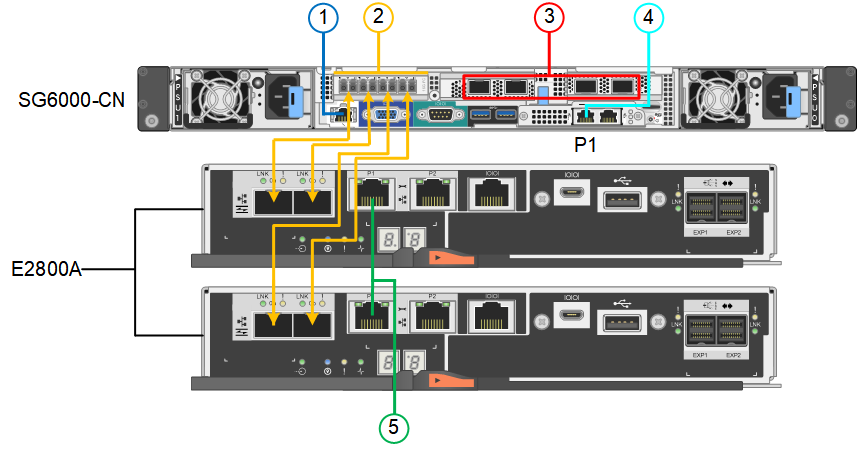

= Kabelgerät (SG6000)
:allow-uri-read: 
:icons: font
:imagesdir: ../media/

[role="lead"]
Sie müssen die Speicher-Controller mit dem SG6000-CN-Controller verbinden, die Management-Ports auf allen drei Controllern verbinden und die Netzwerkports des SG6000-CN-Controllers mit dem Grid-Netzwerk und dem optionalen Client-Netzwerk für StorageGRID verbinden.

.Was Sie und#8217;ll benötigen
* Das Gerät verfügt über die vier optischen Kabel zum Anschließen der beiden Speicher-Controller an den SG6000-CN-Controller.
* Sie verfügen über RJ-45-Ethernet-Kabel (mindestens vier) für den Anschluss der Management-Ports.
* Sie haben eine der folgenden Optionen für die Netzwerkanschlüsse. Diese Artikel sind nicht im Lieferumfang des Geräts enthalten.
+
** Ein bis vier Twinax-Kabel zum Anschließen der vier Netzwerk-Ports.
** Ein bis vier SFP+ oder SFP28 Transceiver, wenn Sie optische Kabel für die Ports verwenden möchten.
+

CAUTION: *Gefahr der Laserstrahlung* -- kein Teil eines SFP-Transceivers zerlegen oder entfernen. Sie können Laserstrahlung ausgesetzt sein.

Dieser Abschnitt enthält Anweisungen zur Verkabelung der folgenden Geräte:

* SG6060 und SG6060X
* SGF6024

== Verkabeln Sie das SG6060 oder SG6060X

Die folgende Abbildung zeigt die drei Controller in den SG6060 und SG6060X Appliances mit dem Compute-Controller SG6000-CN oben und den beiden E2800 Storage Controllern unten.

NOTE: Das SG6060 hat E2800A Controller und das SG6060X ist mit E2800B Controllern ausgestattet. Beide Versionen des E2800 Controllers haben die gleichen Spezifikationen und funktionieren mit Ausnahme der Lage der Interconnect-Ports.

CAUTION: Verwenden Sie keinen E2800A und E2800B Controller im selben Gerät.

*SG6060 bis E2800A Anschlüsse*

*SG6060X auf E2800B-Verbindungen*

image::../media/sg6000x_e2800B_connections.png[SG6060- bis E2800B-Verbindungen]

== Kabel SGF6024

Die folgende Abbildung zeigt die drei Controller in der SGF6024 Appliance mit dem SG6000-CN Compute-Controller oben und den beiden EF570 Storage-Controllern nebeneinander unter dem Computing-Controller.

image::../media/sg6000_ef570_connections.png[SG6000- auf SGF570-Verbindungen]

[cols="1a,2a,2a,3a"]
|===
|  | Port | Typ des Ports | Funktion 

 a| 
1
 a| 
BMC-Management-Port am SG6000-CN Controller
 a| 
1 GbE (RJ-45)
 a| 
Stellt eine Verbindung zum Netzwerk her, in dem Sie auf die BMC-Schnittstelle zugreifen.

 a| 
2
 a| 
FC-Verbindungs-Ports:

* 4 auf dem SG6000-CN-Controller
* 2 auf jedem Storage Controller

 a| 
Optisches 16-Gbit/s FC SFP+
 a| 
Verbinden Sie jeden Speicher-Controller mit dem SG6000-CN-Controller.

 a| 
3
 a| 
Vier Netzwerk-Ports auf dem SG6000-CN Controller
 a| 
10/25-GbE
 a| 
Stellen Sie eine Verbindung zum Grid-Netzwerk und dem Client-Netzwerk für StorageGRID her.

 a| 
4
 a| 
Admin-Netzwerk-Port am SG6000-CN Controller (in der Abbildung auf P1 gekennzeichnet)
 a| 
1 GbE (RJ-45)

*Wichtig:* dieser Port arbeitet nur mit 1000 BaseT/Full und unterstützt keine Geschwindigkeiten von 10 oder 100 Megabit.
 a| 
Verbindet den SG6000-CN-Controller mit dem Admin-Netzwerk für StorageGRID.

 a| 
 a| 
Rechtmäßiger RJ-45-Anschluss am SG6000-CN-Controller
 a| 
1 GbE (RJ-45)

*Wichtig:* dieser Port arbeitet nur mit 1000 BaseT/Full und unterstützt keine Geschwindigkeiten von 10 oder 100 Megabit.
 a| 
* Kann mit Verwaltungsport 1 verbunden werden, wenn Sie eine redundante Verbindung zum Admin-Netzwerk wünschen.
* Kann unverkabelt und für temporären lokalen Zugang verfügbar sein (IP 169.254.0.1).
* Während der Installation kann der SG6000-CN-Controller mit einem Service-Laptop verbunden werden, wenn DHCP-zugewiesene IP-Adressen nicht verfügbar sind.

 a| 
5
 a| 
Management-Port 1 auf jedem Storage Controller
 a| 
1 GbE (RJ-45)
 a| 
Stellt eine Verbindung mit dem Netzwerk her, in dem Sie auf SANtricity System Manager zugreifen.

 a| 
 a| 
Management-Port 2 auf jedem Storage Controller
 a| 
1 GbE (RJ-45)
 a| 
Reserviert für technischen Support.

|===
.Schritte
. Schließen Sie den BMC-Management-Port des SG6000-CN Controllers über ein Ethernet-Kabel an das Managementnetzwerk an.
+
Obwohl diese Verbindung optional ist, wird empfohlen, den Support zu erleichtern.

. Verbinden Sie die beiden FC-Ports an jedem Speicher-Controller mit den FC-Ports des SG6000-CN Controllers. Verwenden Sie dazu vier optische Kabel und vier SFP+-Transceiver für die Speicher-Controller.
. Verbinden Sie die Netzwerk-Ports des SG6000-CN Controllers mit den entsprechenden Netzwerk-Switches über Twinax-Kabel oder optische Kabel und SFP+ oder SFP28 Transceiver.
+

NOTE: Die vier Netzwerkanschlüsse müssen dieselbe Verbindungsgeschwindigkeit verwenden. Installieren Sie SFP+-Transceiver, wenn Sie 10-GbE-Verbindungsgeschwindigkeiten verwenden möchten. Installieren Sie SFP28 Transceiver, wenn Sie 25-GbE-Linkgeschwindigkeiten verwenden möchten.

+
** Wenn Sie den Modus Fixed Port Bond verwenden möchten (Standard), verbinden Sie die Ports mit dem StorageGRID-Grid und den Client-Netzwerken, wie in der Tabelle dargestellt.
+
|===
| Port | Verbindung wird hergestellt mit... 

 a| 
Port 1
 a| 
Client-Netzwerk (optional)

 a| 
Port 2
 a| 
Grid-Netzwerk

 a| 
Port 3
 a| 
Client-Netzwerk (optional)

 a| 
Port 4
 a| 
Grid-Netzwerk

|===
** Wenn Sie den aggregierten Port Bond-Modus verwenden möchten, verbinden Sie einen oder mehrere Netzwerkports mit einem oder mehreren Switches. Sie sollten mindestens zwei der vier Ports verbinden, um einen Single Point of Failure zu vermeiden. Wenn Sie mehrere Switches für eine einzelne LACP-Verbindung verwenden, müssen die Switches MLAG oder Äquivalent unterstützen.

. Wenn Sie das Admin-Netzwerk für StorageGRID verwenden möchten, verbinden Sie den Admin-Netzwerkanschluss des SG6000-CN-Controllers über ein Ethernet-Kabel mit dem Admin-Netzwerk.
. Wenn Sie das Managementnetzwerk für den SANtricity System Manager verwenden möchten, verbinden Sie den Management-Port 1 (P1 auf E2800A und 0a auf E2800B) auf jedem Storage Controller (der RJ-45-Port auf der linken Seite) über ein Ethernet-Kabel mit dem Managementnetzwerk für SANtricity System Manager.
+
Verwenden Sie keinen Managementport 2 (P2 auf E2800A und 0b auf E2800B) an den Speichercontrollern (RJ-45-Port auf der rechten Seite). Dieser Port ist für technischen Support reserviert.

xref:port-bond-modes-for-sg6000-cn-controller.adoc[Port Bond-Modi für SG6000-CN Controller]

xref:reinstalling-sg6000-cn-controller-into-cabinet-or-rack.adoc[Installieren Sie den SG6000-CN Controller wieder in den Schrank oder Rack]
