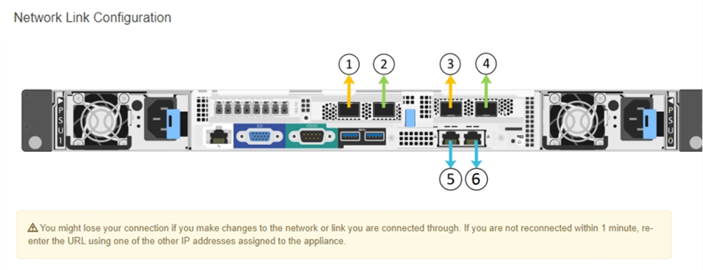

= Konfigurieren von Netzwerkverbindungen (SG6000-Serie)
:allow-uri-read: 
:icons: font
:imagesdir: ../media/

[role="lead"]
Sie können Netzwerkverbindungen für die Ports konfigurieren, die zum Verbinden der Appliance mit dem Grid-Netzwerk, dem Client-Netzwerk und dem Admin-Netzwerk verwendet werden. Sie können die Verbindungsgeschwindigkeit sowie den Port- und Netzwerk-Bond-Modus einstellen.

Wenn Sie einen Appliance-Node klonen, konfigurieren Sie für alle vom Node der Quell-Appliance verwendeten Links für die Ziel-Appliance.

Wenn Sie die 25-GbE-Verbindungsgeschwindigkeit verwenden möchten:

* Sie verwenden SFP28 Twinax-Kabel, oder Sie haben SFP28-Transceiver in den Netzwerkports installiert, die Sie verwenden möchten.
* Sie haben die Netzwerk-Ports mit Switches verbunden, die diese Funktionen unterstützen.
* Sie verstehen, wie Sie die Switches konfigurieren, um diese höhere Geschwindigkeit zu verwenden.

Wenn Sie den aggregierten Port Bond-Modus, den LACP Network Bond-Modus oder VLAN-Tagging verwenden möchten:

* Sie haben die Netzwerk-Ports an der Appliance mit Switches verbunden, die VLAN und LACP unterstützen.
* Wenn mehrere Switches an der LACP-Verbindung beteiligt sind, unterstützen die Switches MLAG (Multi-Chassis Link Aggregation Groups) oder eine vergleichbare Position.
* Sie wissen, wie Sie die Switches für die Verwendung von VLAN, LACP und MLAG oder Ähnliches konfigurieren.
* Sie kennen das eindeutige VLAN-Tag, das für jedes Netzwerk verwendet werden soll. Dieses VLAN-Tag wird zu jedem Netzwerkpaket hinzugefügt, um sicherzustellen, dass der Netzwerkverkehr an das richtige Netzwerk weitergeleitet wird.

Diese Abbildung zeigt, wie die vier Netzwerk-Ports im Bond-Modus mit festen Ports verbunden sind (Standardkonfiguration).

image::../media/sg6000_cn_fixed_port.gif[Bild: Wie die Netzwerkanschlüsse des SG6000-CN-Controllers im festen Modus verbunden sind]

[cols="1a,3a"]
|===
| Legende | Welche Ports sind verbunden 

 a| 
C
 a| 
Die Ports 1 und 3 sind für das Client-Netzwerk verbunden, falls dieses Netzwerk verwendet wird.

 a| 
G
 a| 
Die Ports 2 und 4 sind für das Grid-Netzwerk verbunden.

|===
Die Abbildung zeigt, wie die vier Netzwerk-Ports im Bond-Modus für aggregierte Ports verbunden sind.

image::../media/sg6000_cn_aggregate_port.gif[Das Bild zeigt, wie die Netzwerk-Ports auf dem SG6000-CN-Controller im Aggregatmodus verbunden sind]

[cols="1a,3a"]
|===
| Legende | Welche Ports sind verbunden 

 a| 
1
 a| 
Alle vier Ports werden in einer einzelnen LACP Bond gruppiert, sodass alle Ports für den Grid-Netzwerk- und Client-Netzwerk-Traffic verwendet werden können.

|===
Die Tabellen fassen die Optionen zur Konfiguration der vier Netzwerkanschlüsse zusammen. Die Standardeinstellungen werden fett dargestellt. Sie müssen nur die Einstellungen auf der Seite Link Configuration konfigurieren, wenn Sie eine nicht-Standardeinstellung verwenden möchten.

* *Festes (Standard) Port Bond-Modus*
+
[cols="1a,3a,3a"]
|===
| Netzwerk-Bond-Modus | Client-Netzwerk deaktiviert (Standard) | Client-Netzwerk aktiviert 

 a| 
Aktiv/Backup (Standard)
 a| 
** Die Ports 2 und 4 verwenden eine aktiv-Backup-Verbindung für das Grid Network.
** Die Ports 1 und 3 werden nicht verwendet.
** Ein VLAN-Tag ist optional.

 a| 
** Die Ports 2 und 4 verwenden eine aktiv-Backup-Verbindung für das Grid Network.
** Die Ports 1 und 3 verwenden eine aktiv-Backup-Verbindung für das Client-Netzwerk.
** VLAN-Tags können für beide Netzwerke angegeben werden.

 a| 
LACP (802.3ad)
 a| 
** Die Ports 2 und 4 verwenden eine LACP-Verbindung für das Grid-Netzwerk.
** Die Ports 1 und 3 werden nicht verwendet.
** Ein VLAN-Tag ist optional.

 a| 
** Die Ports 2 und 4 verwenden eine LACP-Verbindung für das Grid-Netzwerk.
** Die Ports 1 und 3 verwenden eine LACP Bond für das Client-Netzwerk.
** VLAN-Tags können für beide Netzwerke angegeben werden.

|===
* * Aggregat-Port-Bond-Modus*
+
[cols="1a,3a,3a"]
|===
| Netzwerk-Bond-Modus | Client-Netzwerk deaktiviert (Standard) | Client-Netzwerk aktiviert 

 a| 
Nur LACP (802.3ad
 a| 
** Die Ports 1-4 verwenden einen einzelnen LACP Bond für das Grid Network.
** Ein einzelnes VLAN-Tag identifiziert Grid-Netzwerkpakete.

 a| 
** Die Ports 1-4 verwenden eine einzelne LACP-Verbindung für das Grid-Netzwerk und das Client-Netzwerk.
** Zwei VLAN-Tags ermöglichen die Trennung von Grid-Netzwerkpaketen von Client-Netzwerkpaketen.

|===

Siehe xref:port-bond-modes-for-sg6000-cn-controller.adoc[Port Bond-Modi für SG6000-CN Controller] Weitere Informationen zu Port Bond- und Netzwerk-Bond-Modi.

Diese Abbildung zeigt, wie die beiden 1-GbE-Management-Ports des SG6000-CN-Controllers im Active-Backup-Netzwerk-Bond-Modus des Admin-Netzwerks verbunden sind.

image::../media/sg6000_cn_bonded_managemente_ports.gif[Anschluss Der Admin-Netzwerk-Ports]

.Schritte
. Klicken Sie im Installationsprogramm der StorageGRID-Appliance auf *Netzwerke konfigurieren* *Link-Konfiguration*.
+
Auf der Seite Network Link Configuration wird ein Diagramm der Appliance angezeigt, in dem die Netzwerk- und Verwaltungsports nummeriert sind.

+

+
In der Tabelle „Link-Status“ werden der Verbindungsstatus (nach oben/unten) und die Geschwindigkeit (1/10/25/40/100 Gbit/s) der nummerierten Ports aufgeführt.

+
image::../media/sg6060_configuring_network_linkstatus.png[Link-Statustabelle]

+
Das erste Mal, wenn Sie diese Seite aufrufen:

+
** *Verbindungsgeschwindigkeit* ist auf *Auto* eingestellt.
** *Port Bond Modus* ist auf *fest* eingestellt.
** *Network Bond Mode* ist für das Grid Network auf *Active-Backup* eingestellt.
** Das *Admin-Netzwerk* ist aktiviert, und der Netzwerk-Bond-Modus ist auf *unabhängig* eingestellt.
** Das *Client-Netzwerk* ist deaktiviert.
+
image::../media/network_link_configuration_fixed.png[Konfiguration Der Netzwerkverbindung Wurde Behoben]

. Wenn Sie die 25-GbE-Verbindungsgeschwindigkeit für die Netzwerkanschlüsse verwenden möchten, wählen Sie in der Dropdown-Liste Verbindungsgeschwindigkeit die Option *automatisch* aus.
+
Die Netzwerk-Switches, die Sie für das Grid-Netzwerk und das Client-Netzwerk verwenden, müssen ebenfalls für diese Geschwindigkeit konfiguriert sein. Sie müssen SFP28 Twinax-Kabel oder optische Kabel und SFP28-Transceiver verwenden.

. Aktivieren oder deaktivieren Sie die StorageGRID-Netzwerke, die Sie verwenden möchten.
+
Das Grid-Netzwerk ist erforderlich. Sie können dieses Netzwerk nicht deaktivieren.

+
.. Wenn das Gerät nicht mit dem Admin-Netzwerk verbunden ist, deaktivieren Sie das Kontrollkästchen *Netzwerk aktivieren* für das Admin-Netzwerk.
+
image::../media/admin_network_disabled.gif[Screenshot mit Kontrollkästchen zum Aktivieren oder Deaktivieren des Admin-Netzwerks]

.. Wenn das Gerät mit dem Client-Netzwerk verbunden ist, aktivieren Sie das Kontrollkästchen *Netzwerk aktivieren* für das Client-Netzwerk.
+
Die Client-Netzwerkeinstellungen für die Netzwerkanschlüsse werden jetzt angezeigt.

. In der Tabelle finden Sie Informationen zum Konfigurieren des Port-Bond-Modus und des Netzwerk-Bond-Modus.
+
Dieses Beispiel zeigt:

+
** *Aggregate* und *LACP* ausgewählt für das Grid und die Client Netzwerke. Sie müssen für jedes Netzwerk ein eindeutiges VLAN-Tag angeben. Sie können Werte zwischen 0 und 4095 auswählen.
** *Active-Backup* für das Admin-Netzwerk ausgewählt.
+
image::../media/network_link_configuration_aggregate.gif[Screenshot mit den Link-Konfigurationseinstellungen für den Aggregatmodus]

. Wenn Sie mit Ihrer Auswahl zufrieden sind, klicken Sie auf *Speichern*.
+

NOTE: Wenn Sie Änderungen am Netzwerk oder an der Verbindung vorgenommen haben, über die Sie verbunden sind, können Sie die Verbindung verlieren. Wenn Sie nicht innerhalb von einer Minute eine Verbindung hergestellt haben, geben Sie die URL für das Installationsprogramm für StorageGRID-Appliances erneut ein. Verwenden Sie dabei eine der beiden Antworten xref:configuring-storagegrid-ip-addresses-sg6000.adoc[IP-Adressen] Dem Gerät zugewiesen: `*https://_SG6000-CN_Controller_IP_:8443*`

