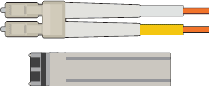

= Zusätzliche Ausrüstung und Werkzeuge (SG6000)
:allow-uri-read: 
:icons: font
:imagesdir: ../media/

[role="lead"]
Vergewissern Sie sich vor der Installation der StorageGRID Appliance, dass alle zusätzlichen Geräte und Tools zur Verfügung stehen, die Sie benötigen.

Sie benötigen die folgende zusätzliche Ausrüstung für die Installation und Konfiguration der Hardware:

* *Schraubendreher*
+
image::../media/screwdrivers.gif[Zwei Schraubendreher]

+
Phillips Nr. 2 Schraubendreher

+
Mittlerer Schlitzschraubendreher

* *ESD-Handgelenkschlaufe*
+
image::../media/appliance_wriststrap.gif[ESD-Handgelenkschlaufe]

* *Optische Kabel und SFP-Transceiver*
+

+
Sie benötigen eine der folgenden Optionen:

+
** Ein bis vier Twinax-Kabel oder optische Kabel für die 10/25-GbE-Ports, die Sie auf dem SG6000-CN Controller verwenden möchten
** Ein bis vier SFP+-Transceiver für die 10/25-GbE-Ports, wenn Sie optische Kabel und 10-GbE-Verbindungsgeschwindigkeit verwenden
** Ein bis vier SFP28-Transceiver für die 10/25-GbE-Ports, wenn Sie optische Kabel und 25-GbE-Verbindungsgeschwindigkeit verwenden werden

* * RJ-45 (Cat5/Cat5e/Cat6) Ethernet-Kabel*
+
image::../media/ethernet_cables.png[Ethernet-Kabel]

* *Service-Laptop*
+
image::../media/sam_management_client.gif[Service-Laptop]

+
xref:../admin/web-browser-requirements.adoc[Unterstützter Webbrowser]

+
1-GbE-Port (RJ-45

* *Optionale Werkzeuge*
+
image::../media/optional_tools.gif[Kraftbohrer und Taschenlampe]

+
Kraftbohrer mit Kreuzschlitz

+
Taschenlampe

+
Mechanisierter Lift für 60-Laufwerk-Shelfs

