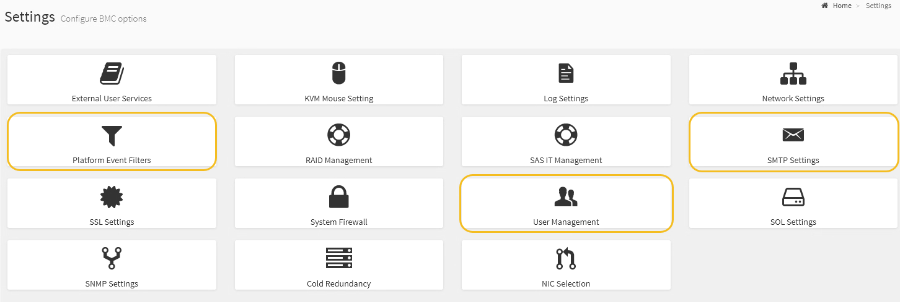

= Richten Sie E-Mail-Benachrichtigungen für Warnmeldungen ein
:allow-uri-read: 
:icons: font
:imagesdir: ../media/

[role="lead"]
Wenn E-Mail-Benachrichtigungen gesendet werden sollen, wenn Warnmeldungen auftreten, müssen Sie SMTP-Einstellungen, Benutzer, LAN-Ziele, Warnrichtlinien und Ereignisfilter über die BMC-Schnittstelle konfigurieren.

NOTE: Die durch dieses Verfahren vorgenommenen BMC-Einstellungen bleiben möglicherweise nicht erhalten, wenn das SG6000-CN ausfällt und ersetzt werden muss. Stellen Sie sicher, dass Sie über eine Aufzeichnung aller Einstellungen verfügen, die Sie angewendet haben, so dass sie nach einem Hardware-Austausch bei Bedarf leicht wieder angewendet werden können.

.Was Sie benötigen
Wissen Sie, wie Sie auf das BMC-Dashboard zugreifen können.

.Über diese Aufgabe
In der BMC-Schnittstelle verwenden Sie die Optionen *SMTP-Einstellungen*, *Benutzerverwaltung* und *Platform Event Filters* auf der Seite Einstellungen, um E-Mail-Benachrichtigungen zu konfigurieren.

.Schritte
. Konfigurieren Sie die SMTP-Einstellungen.
+
.. Wählen Sie *Einstellungen* *SMTP-Einstellungen*.
.. Geben Sie für die Absender-E-Mail-ID eine gültige E-Mail-Adresse ein.
+
Diese E-Mail-Adresse wird als von-Adresse angegeben, wenn der BMC E-Mail sendet.

. Richten Sie Benutzer für den Empfang von Warnungen ein.
+
.. Wählen Sie im BMC-Dashboard *Einstellungen* *Benutzerverwaltung* aus.
.. Fügen Sie mindestens einen Benutzer hinzu, um Benachrichtigungen zu erhalten.
+
Die für einen Benutzer konfigurierte E-Mail-Adresse ist die Adresse, an die BMC Warnmeldungen sendet. Sie können beispielsweise einen generischen Benutzer wie „`notification-user,`“ hinzufügen und die E-Mail-Adresse einer E-Mail-Verteilerliste für das technische Support-Team verwenden.

. Konfigurieren Sie das LAN-Ziel für Meldungen.
+
.. Wählen Sie *Einstellungen* *Plattformereignisfilter* *LAN-Ziele*.
.. Konfigurieren Sie mindestens ein LAN-Ziel.
+
*** Wählen Sie als Zieltyp *E-Mail* aus.
*** Wählen Sie für BMC-Benutzername einen Benutzernamen aus, den Sie zuvor hinzugefügt haben.
*** Wenn Sie mehrere Benutzer hinzugefügt haben und alle Benutzer Benachrichtigungen erhalten möchten, müssen Sie für jeden Benutzer ein LAN-Ziel hinzufügen.

.. Eine Testwarnung senden.

. Konfigurieren von Meldungsrichtlinien, um festzulegen, wann und wo BMC Alarme sendet
+
.. Wählen Sie *Einstellungen* *Plattformereignisfilter* *Benachrichtigungsrichtlinien*.
.. Konfigurieren Sie mindestens eine Meldungsrichtlinie für jedes LAN-Ziel.
+
*** Wählen Sie für die Policengruppennummer *1* aus.
*** Wählen Sie für Policy Action * immer Warnung an dieses Ziel senden* aus.
*** Wählen Sie für LAN-Kanal *1* aus.
*** Wählen Sie in der Zielauswahl das LAN-Ziel für die Richtlinie aus.

. Ereignisfilter konfigurieren, um Warnmeldungen für verschiedene Ereignistypen an die entsprechenden Benutzer zu leiten.
+
.. Wählen Sie *Einstellungen* *Plattformereignisfilter* *Ereignisfilter*.
.. Geben Sie für die Nummer der Meldungsrichtlinie *1* ein.
.. Erstellen Sie Filter für jedes Ereignis, über das die Meldungsrichtlinie-Gruppe benachrichtigt werden soll.
+
*** Sie können Ereignisfilter für Energieaktionen, bestimmte Sensorereignisse oder alle Ereignisse erstellen.
*** Wenn Sie unsicher sind, welche Ereignisse überwacht werden sollen, wählen Sie *Alle Sensoren* für den Sensortyp und *Alle Ereignisse* für Ereignisoptionen. Wenn Sie unerwünschte Benachrichtigungen erhalten, können Sie Ihre Auswahl später ändern.

