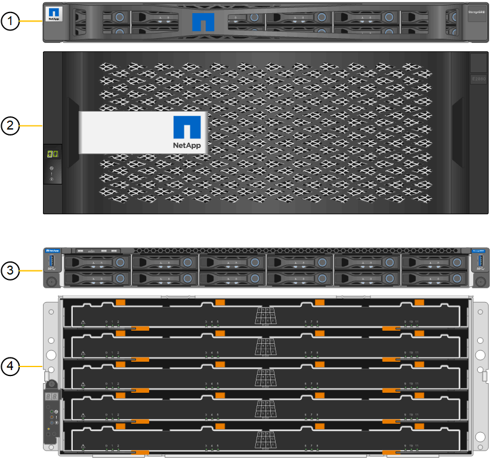

= SG6060- und SG6060X-Appliances
:allow-uri-read: 
:icons: font
:imagesdir: ../media/

[role="lead"]
Die StorageGRID SG6060 und SG6060X Appliances umfassen jeweils einen Computing-Controller und ein Storage-Controller-Shelf, das zwei Storage Controller und 60 Laufwerke enthält. Optional können beide Appliances mit Erweiterungs-Shelfs für 60 Laufwerke ergänzt werden. Es gibt keine Spezifikationen oder funktionalen Unterschiede zwischen dem SG6060 und SG6060X, außer der Position der Interconnect-Ports am Storage Controller.

== Komponenten SG6060 und SG6060X

Die Appliances SG6060 und SG660X umfassen die folgenden Komponenten:

[cols="1a,2a"]
|===
| Komponente | Beschreibung 

 a| 
Computing-Controller
 a| 
SG6000-CN-Controller, ein 1U-Server (1 Rack-Einheit) mit folgenden Komponenten:

* 40 Cores (80 Threads)
* 192 GB RAM
* Bis zu 4 × 25 Gbit/s aggregierte Ethernet-Bandbreite
* FC-Interconnect mit 4 × 16 GBit/s
* Baseboard Management Controller (BMC) der das Hardware-Management vereinfacht
* Redundante Netzteile

 a| 
Storage Controller Shelf
 a| 
E-Series E2860 Controller-Shelf (Storage-Array), ein 4-HE-Shelf mit folgenden Komponenten:

* Zwei Controller der E2800 Serie (Duplexkonfiguration) für die Unterstützung von Storage Controller Failover
+
** Das SG6060 enthält E2800A Storage Controller
** Das SG6060X enthält E2800B Storage Controller

* Shelf mit fünf Einschüben für Festplatten mit 60 3.5-Zoll-Laufwerken (2 Solid State-Laufwerke bzw. SSDs und 58 NL-SAS-Laufwerke)
* Redundante Netzteile und Lüfter

 a| 
Optional: Storage-Erweiterungs-Shelfs

*Hinweis:* Erweiterungseinschübe können bei der ersten Implementierung installiert oder später hinzugefügt werden.
 a| 
E-Series DE460C Gehäuse, ein 4-HE-Shelf mit folgenden Komponenten:

* Zwei Eingangs-/Ausgangsmodule (IOMs)
* Fünf Schubladen mit jeweils 12 NL-SAS-Laufwerken für insgesamt 60 Laufwerke
* Redundante Netzteile und Lüfter

Jede SG6060- und SG6060X-Appliance kann ein oder zwei Erweiterungs-Shelfs für insgesamt 180 Laufwerke enthalten.

|===

== SG6060- und 6060X-Diagramme

Die Fronten des SG6060 und des SG6060X sind identisch. Die folgende Abbildung zeigt die Vorderseite des SG6060, der einen 1-HE-Computing-Controller und ein 4-HE-Shelf mit zwei Storage-Controllern und 60 Laufwerken in fünf Laufwerkseinschüben umfasst.

*SG6060 Vorderansicht*

[cols="1a,2a"]
|===
| Legende | Beschreibung 

 a| 
1
 a| 
SG6000-CN Computing Controller mit Frontblende

 a| 
2
 a| 
E2860 Controller-Shelf mit Frontblende (optionales Erweiterungs-Shelf erscheint identisch)

 a| 
3
 a| 
SG6000-CN Computing Controller mit abnehmbarer Frontblende

 a| 
4
 a| 
E2860 Controller-Shelf mit entfernter Frontblende (optionales Erweiterungs-Shelf erscheint identisch)

|===
Die folgenden Abbildungen zeigen die Rückseite des SG6060 und des SG6060X, einschließlich der Computing- und Storage-Controller, Lüfter und Netzteile.

*SG6060 Rückansicht*

image::../media/sg6060_rear_view.gif[SG6060 Rückansicht]

[cols="1a,2a"]
|===
| Legende | Beschreibung 

 a| 
1
 a| 
Netzteil (1 von 2) für SG6000-CN Compute Controller

 a| 
2
 a| 
Anschlüsse für SG6000-CN Compute Controller

 a| 
3
 a| 
Lüfter (1 von 2) für E2860 Controller-Shelf

 a| 
4
 a| 
E-Series E2800A Storage-Controller (1 von 2) und Anschlüsse

 a| 
5
 a| 
Netzteil (1 von 2) für E2860 Controller-Shelf

|===
*SG6060X Rückansicht*

image::../media/sg6060x_rear_view.gif[SG6060x Rückansicht]

[cols="1a,2a"]
|===
| Legende | Beschreibung 

 a| 
1
 a| 
Netzteil (1 von 2) für SG6000-CN Compute Controller

 a| 
2
 a| 
Anschlüsse für SG6000-CN Compute Controller

 a| 
3
 a| 
Lüfter (1 von 2) für E2860 Controller-Shelf

 a| 
4
 a| 
E-Series E2800B Storage-Controller (1 von 2) und Anschlüsse

 a| 
5
 a| 
Netzteil (1 von 2) für E2860 Controller-Shelf

|===
*SG6060 und SG6060X Erweiterungs-Shelf*

Diese Abbildung zeigt die Rückseite des optionalen Erweiterungs-Shelfs für SG6060 und SG6060X, einschließlich der ein-/Ausgabemodule (IOMs), Lüfter und Netzteile. Jedes SG6060 und SG6060X kann mit einem oder zwei Erweiterungs-Shelfs installiert werden, die in der Erstinstallation enthalten oder später hinzugefügt werden können.

image::../media/de460c_expansion_shelf_rear_view.gif[Erweiterungs-Shelf Hinten]

[cols="1a,2a"]
|===
| Legende | Beschreibung 

 a| 
1
 a| 
Lüfter (1 von 2) für Erweiterungs-Shelf

 a| 
2
 a| 
IOM (1 von 2) für Erweiterungs-Shelf

 a| 
3
 a| 
Netzteil (1 von 2) für Erweiterungs-Shelf

|===