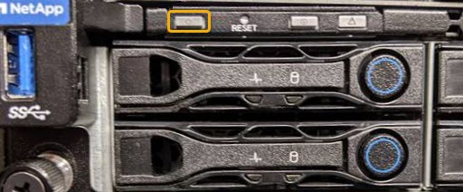

= Fahren Sie den SG6000-CN-Controller herunter
:allow-uri-read: 
:icons: font
:imagesdir: ../media/

[role="lead"]
Fahren Sie den SG6000-CN-Controller herunter, um die Hardware zu warten.

.Was Sie benötigen
* Der SG6000-CN Controller ist physisch zu finden, der im Datacenter gewartet werden muss.
+
xref:locating-controller-in-data-center.adoc[Controller im Datacenter finden]

* Das Gerät war xref:placing-appliance-into-maintenance-mode.adoc[Wird in den Wartungsmodus versetzt].

.Über diese Aufgabe
Um Serviceunterbrechungen zu vermeiden, vergewissern Sie sich, dass alle anderen Storage-Nodes mit dem Grid verbunden sind, bevor Sie den Controller herunterfahren oder den Controller während eines geplanten Wartungsfensters herunterfahren, wenn die Serviceunterbrechungen akzeptabel sind. Informationen zum Bestimmen von Knotenverbindungsstatus finden Sie in den Anweisungen zum Verwalten von Objekten mit Information Lifecycle Management.

IMPORTANT: Wenn Sie jemals eine ILM-Regel verwendet haben, die nur eine Kopie eines Objekts erstellt, müssen Sie den Controller während eines geplanten Wartungsfensters herunterfahren. Andernfalls verlieren Sie während dieses Verfahrens vorübergehend den Zugriff auf diese Objekte. Siehe link:../ilm/index.html["Verwalten von Objekten mit Information Lifecycle Management"].

.Schritte
. Wenn das Gerät in den Wartungsmodus versetzt wurde, fahren Sie den SG6000-CN-Controller herunter:
+

CAUTION: Sie müssen das Herunterfahren des Controllers steuern, indem Sie die unten angegebenen Befehle eingeben. Wenn Sie den Controller mit dem Netzschalter herunterfahren, führt dies zu Datenverlust.

+
.. Melden Sie sich mit PuTTY oder einem anderen SSH-Client am Grid-Knoten an:
+
... Geben Sie den folgenden Befehl ein: `ssh admin@_grid_node_IP_`
... Geben Sie das im aufgeführte Passwort ein `Passwords.txt` Datei:
... Geben Sie den folgenden Befehl ein, um zum Root zu wechseln: `su -`
... Geben Sie das im aufgeführte Passwort ein `Passwords.txt` Datei:
+
Wenn Sie als root angemeldet sind, ändert sich die Eingabeaufforderung von `$` Bis `#`.

.. Fahren Sie den SG6000-CN-Controller herunter: +
`*shutdown -h now*`
+
Dieser Befehl kann bis zu 10 Minuten in Anspruch nehmen.

. Überprüfen Sie anhand einer der folgenden Methoden, ob der SG6000-CN-Controller ausgeschaltet ist:
+
** Schauen Sie sich die blaue ein/aus-LED an der Vorderseite des Controllers an und bestätigen Sie, dass sie ausgeschaltet ist.
+

** Schauen Sie sich die grünen LEDs an den beiden Netzteilen auf der Rückseite des Controllers an und bestätigen Sie, dass sie mit einer normalen Geschwindigkeit (etwa ein Blinken pro Sekunde) blinken.
+
image::../media/sg6060_rear_panel_power_led_on.jpg[LED für Stromversorgung auf der Rückseite des SG6060]

** Verwenden Sie die BMC-Schnittstelle des Controllers:
+
... Greifen Sie auf die BMC-Schnittstelle des Controllers zu.
+
xref:accessing-bmc-interface-sg6000.adoc[Greifen Sie auf die BMC-Schnittstelle zu]

... Wählen Sie *Power Control*.
... Stellen Sie sicher, dass die Strommaßnahmen darauf hindeuten, dass der Host derzeit ausgeschaltet ist.
+
image::../media/bmc_power_control_page_controller_off.png[BMC Power Control Seite - Controller aus]

.Verwandte Informationen
xref:removing-sg6000-cn-controller-from-cabinet-or-rack.adoc[Entfernen Sie den SG6000-CN Controller aus dem Schrank oder Rack]
