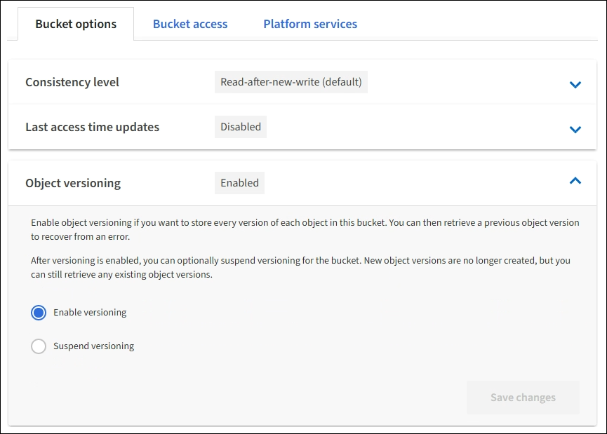

= Ändern Sie die Objektversionierung für einen Bucket
:allow-uri-read: 
:icons: font
:imagesdir: ../media/

[role="lead"]
Wenn Sie einen S3-Mandanten verwenden, können Sie den Mandanten-Manager oder die Mandanten-Management-API verwenden, um den Versionierungsstatus für S3 Buckets zu ändern.

.Was Sie und#8217;ll benötigen
* Sie sind mit einem beim Mandantenmanager angemeldet xref:../admin/web-browser-requirements.adoc[Unterstützter Webbrowser].
* Sie gehören zu einer Benutzergruppe mit den Berechtigungen Alle Buckets verwalten oder Root Access. Diese Berechtigungen überschreiben die Berechtigungseinstellungen in Gruppen- oder Bucket-Richtlinien.
+
xref:tenant-management-permissions.adoc[Mandantenmanagement-Berechtigungen]

Sie können die Objektversionierung für einen Bucket aktivieren oder aussetzen. Nachdem Sie die Versionierung für einen Bucket aktiviert haben, kann dieser nicht wieder in einen nichtversionierten Zustand zurückkehrt. Sie können die Versionierung für den Bucket jedoch unterbrechen.

* Deaktiviert: Versionierung wurde noch nie aktiviert
* Aktiviert: Versionierung ist aktiviert
* Suspendiert: Die Versionierung war zuvor aktiviert und wird ausgesetzt

xref:../s3/object-versioning.adoc[S3 Objektversionierung]

xref:../ilm/example-4-ilm-rules-and-policy-for-s3-versioned-objects.adoc[ILM-Regeln und Richtlinien für versionierte S3-Objekte (Beispiel 4)]

.Schritte
. Wählen Sie *STORAGE (S3)* *Buckets* aus.
. Wählen Sie den Bucket-Namen aus der Liste aus.
. Wählen Sie *Bucket-Optionen* *Objektversionierung* aus.
+

. Wählen Sie einen Versionierungsstatus für die Objekte in diesem Bucket aus.
+

NOTE: Wenn die S3-Objektsperre oder die ältere Compliance aktiviert ist, sind die Optionen *Objektversionierung* deaktiviert.

+
[cols="1a,3a"]
|===
| Option | Beschreibung 

 a| 
Aktivieren Sie die Versionierung
 a| 
Aktivieren Sie die Objektversionierung, wenn Sie jede Version jedes Objekts in diesem Bucket speichern möchten. Sie können dann nach Bedarf frühere Versionen eines Objekts abrufen.

Objekte, die sich bereits im Bucket befanden, werden versioniert, wenn sie von einem Benutzer geändert werden.

 a| 
Die Versionierung unterbrechen
 a| 
Unterbrechen Sie die Objektversionierung, wenn Sie keine neuen Objektversionen mehr erstellen möchten. Sie können weiterhin alle vorhandenen Objektversionen abrufen.

|===
. Wählen Sie *Änderungen speichern*.

