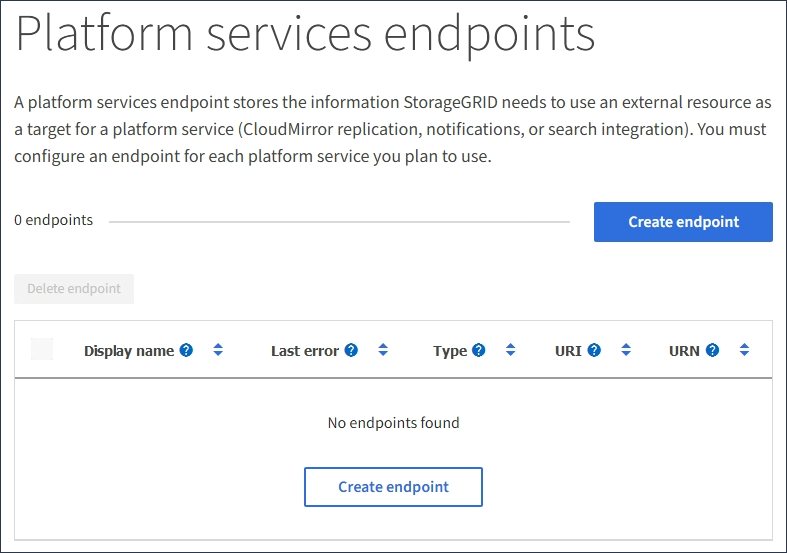
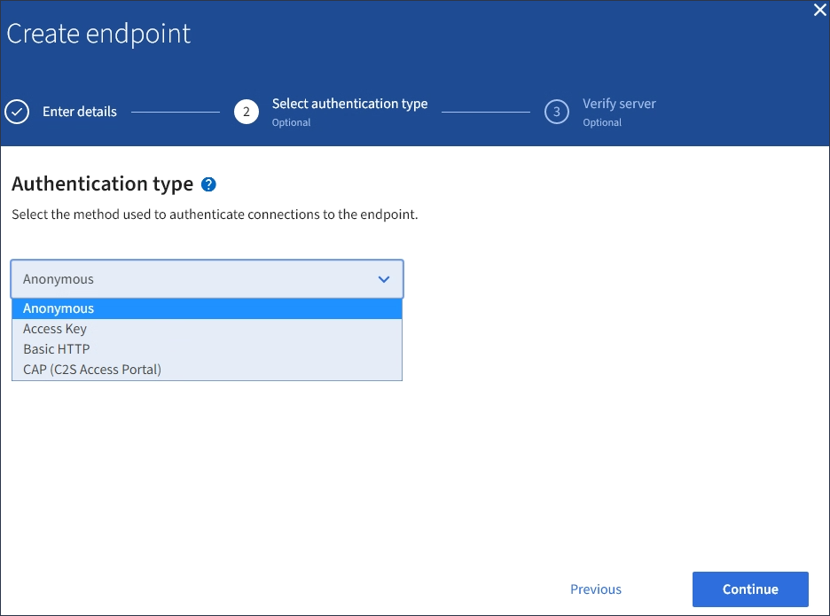

= Endpunkt für Plattformservices erstellen
:allow-uri-read: 
:icons: font
:imagesdir: ../media/

[role="lead"]
Sie müssen mindestens einen Endpunkt des richtigen Typs erstellen, bevor Sie einen Plattformdienst aktivieren können.

.Was Sie und#8217;ll benötigen
* Sie müssen mit einem beim Mandantenmanager angemeldet sein xref:../admin/web-browser-requirements.adoc[Unterstützter Webbrowser].
* Plattform-Services müssen von einem StorageGRID-Administrator für Ihr Mandantenkonto aktiviert werden.
* Sie müssen einer Benutzergruppe angehören, die über die Berechtigung Endpunkte verwalten verfügt.
* Die Ressource, auf die der Endpunkt der Plattformservices verweist, muss erstellt worden sein:
+
** CloudMirror Replizierung: S3 Bucket
** Ereignisbenachrichtigung: SNS-Thema
** Suchbenachrichtigung: Elasticsearch-Index, wenn das Ziel-Cluster nicht konfiguriert ist, Indizes automatisch zu erstellen.

* Sie müssen über die Informationen zur Zielressource verfügen:
+
** Host und Port für den Uniform Resource Identifier (URI)
+

NOTE: Wenn Sie einen Bucket verwenden möchten, der auf einem StorageGRID-System als Endpunkt für die CloudMirror-Replizierung gehostet wird, wenden Sie sich an den Grid-Administrator, um die erforderlichen Werte zu bestimmen.

** Eindeutiger Ressourcenname (URN)
+
xref:specifying-urn-for-platform-services-endpoint.adoc[URN für Endpunkt von Plattformservices angeben]

** Authentifizierungsdaten (falls erforderlich):
+
*** Zugriffsschlüssel: Zugriffsschlüssel-ID und geheimer Zugriffsschlüssel
*** Basic HTTP: Benutzername und Passwort
*** CAP (C2S Access Portal): Temporäre Anmeldeinformationen URL, Server- und Client-Zertifikate, Clientschlüssel und eine optionale private Client-Schlüssel-Passphrase.

** Sicherheitszertifikat (bei Verwendung eines benutzerdefinierten CA-Zertifikats)

.Schritte
. Wählen Sie *STORAGE (S3)* *Plattform-Services-Endpunkte* aus.
+
Die Seite „Endpunkte der Plattformdienste“ wird angezeigt.

+

. Wählen Sie *Endpunkt erstellen*.
+
image::../media/endpoint_create.png[Endpunkt Erstellen]

. Geben Sie einen Anzeigenamen ein, um den Endpunkt und seinen Zweck kurz zu beschreiben.
+
Der vom Endpunkt unterstützte Plattformdienst wird neben dem Endpunkt-Namen angezeigt, wenn er auf der Seite Endpoints aufgeführt wird. Sie müssen diese Informationen also nicht in den Namen einfügen.

. Geben Sie im Feld *URI* den eindeutigen Resource Identifier (URI) des Endpunkts an.
+
Verwenden Sie eines der folgenden Formate:

+
[listing]
----
https://host:port
http://host:port
----
+
Wenn Sie keinen Port angeben, wird Port 443 für HTTPS-URIs verwendet, und Port 80 wird für HTTP-URIs verwendet.

+
Beispielsweise kann der URI für einen Bucket, der auf StorageGRID gehostet wird, folgende sein:

+
[listing]
----
https://s3.example.com:10443
----
+
In diesem Beispiel `s3.example.com` Stellt den DNS-Eintrag für die virtuelle IP (VIP) der StorageGRID HA-Gruppe dar und `10443` Stellt den Port dar, der im Endpunkt des Load Balancer definiert ist.

+

NOTE: Wenn möglich, sollten Sie sich mit einer HA-Gruppe von Lastausgleichs Nodes verbinden, um einen Single Point of Failure zu vermeiden.

+
Auf ähnliche Weise kann der URI für einen Bucket sein, der auf AWS gehostet wird,:

+
[listing]
----
https://s3-aws-region.amazonaws.com
----
+

NOTE: Wenn der Endpunkt für den CloudMirror-Replikationsservice verwendet wird, geben Sie den Bucket-Namen nicht in den URI ein. Sie fügen den Bucket-Namen in das Feld *URN* ein.

. Geben Sie den eindeutigen Ressourcennamen (URN) für den Endpunkt ein.
+

NOTE: Sie können den URN eines Endpunktes nicht ändern, nachdem der Endpunkt erstellt wurde.

. Wählen Sie *Weiter*.
. Wählen Sie einen Wert für *Authentifizierungstyp* aus, und geben Sie dann die erforderlichen Anmeldedaten ein oder laden Sie sie hoch.
+

+
Die von Ihnen eingegebenen Anmeldeinformationen müssen über Schreibberechtigungen für die Zielressource verfügen.

+
[cols="1a,2a,2a"]
|===
| Authentifizierungstyp | Beschreibung | Anmeldedaten 

 a| 
Anonym
 a| 
Gibt anonymen Zugriff auf das Ziel. Funktioniert nur für Endpunkte, bei denen die Sicherheit deaktiviert ist.
 a| 
Keine Authentifizierung.

 a| 
Zugriffsschlüssel
 a| 
Verwendet AWS Zugangsdaten für die Authentifizierung von Verbindungen mit dem Ziel
 a| 
** Zugriffsschlüssel-ID
** Geheimer Zugriffsschlüssel

 a| 
Basis-HTTP
 a| 
Verwendet einen Benutzernamen und ein Passwort, um Verbindungen zum Ziel zu authentifizieren.
 a| 
** Benutzername
** Passwort

 a| 
KAPPE (C2S-Zugangsportal)
 a| 
Verwendet Zertifikate und Schlüssel zur Authentifizierung von Verbindungen zum Ziel.
 a| 
** URL für temporäre Anmeldeinformationen
** Server-CA-Zertifikat (PEM-Datei-Upload)
** Client-Zertifikat (PEM-Datei-Upload)
** Privater Client-Schlüssel (Upload der PEM-Datei, verschlüsseltes OpenSSL-Format oder unverschlüsseltes privates Schlüsselformat)
** Private Client-Schlüssel-Passphrase (optional)

|===
. Wählen Sie *Weiter*.
. Wählen Sie eine Optionsschaltfläche für *Server überprüfen* aus, um auszuwählen, wie die TLS-Verbindung zum Endpunkt verifiziert wird.
+
image::../media/endpoint_create_verify_server.png[Endpunkt Erstellen – Zertifikat Validieren]

+
[cols="1a,2a"]
|===
| Typ der Zertifikatverifizierung | Beschreibung 

 a| 
Benutzerdefiniertes CA-Zertifikat verwenden
 a| 
Verwenden Sie ein benutzerdefiniertes Sicherheitszertifikat. Wenn Sie diese Einstellung auswählen, kopieren Sie das benutzerdefinierte Sicherheitszertifikat in das Textfeld *CA-Zertifikat*.

 a| 
Verwenden Sie das CA-Zertifikat für das Betriebssystem
 a| 
Verwenden Sie das auf dem Betriebssystem installierte Standard-Grid-CA-Zertifikat, um Verbindungen zu sichern.

 a| 
Verifizieren Sie das Zertifikat nicht
 a| 
Das für die TLS-Verbindung verwendete Zertifikat wird nicht verifiziert. Diese Option ist nicht sicher.

|===
. Wählen Sie *Test und Endpunkt erstellen*.
+
** Eine Erfolgsmeldung wird angezeigt, wenn der Endpunkt mit den angegebenen Anmeldeinformationen erreicht werden kann. Die Verbindung zum Endpunkt wird von einem Node an jedem Standort validiert.
** Wenn die Endpoint-Validierung fehlschlägt, wird eine Fehlermeldung angezeigt. Wenn Sie den Endpunkt ändern müssen, um den Fehler zu beheben, wählen Sie *Zurück zu Endpunktdetails* und aktualisieren Sie die Informationen. Wählen Sie anschließend *Test und Endpunkt erstellen* aus.
+

NOTE: Die Endpoint-Erstellung schlägt fehl, wenn Plattformdienste für Ihr Mandantenkonto nicht aktiviert sind. Wenden Sie sich an den StorageGRID-Administrator.

Nachdem Sie einen Endpunkt konfiguriert haben, können Sie mit seinem URN einen Plattformdienst konfigurieren.

xref:specifying-urn-for-platform-services-endpoint.adoc[URN für Endpunkt von Plattformservices angeben]

xref:configuring-cloudmirror-replication.adoc[CloudMirror-Replizierung konfigurieren]

xref:configuring-event-notifications.adoc[Konfigurieren Sie Ereignisbenachrichtigungen]

xref:configuring-search-integration-service.adoc[Konfigurieren Sie den Suchintegrationsdienst]
