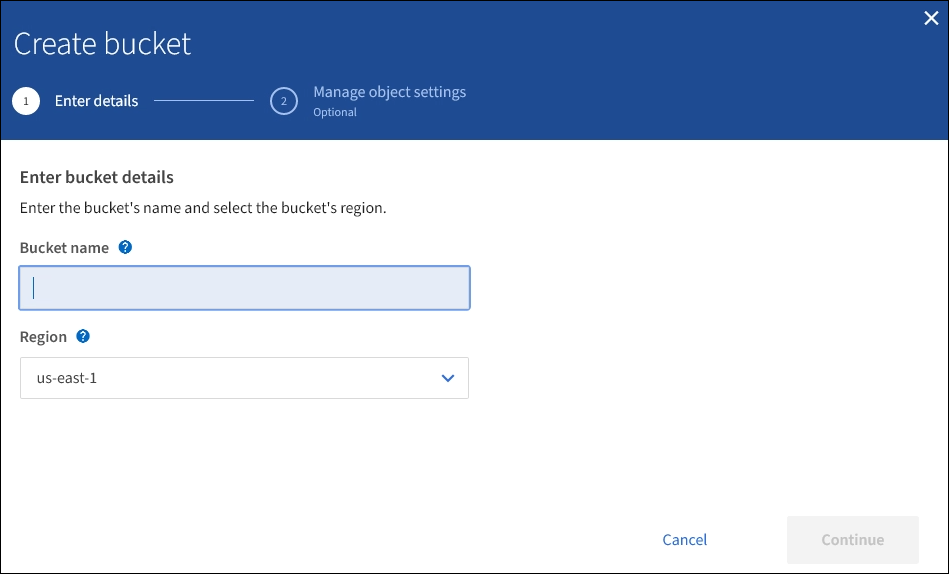

= S3-Bucket erstellen
:allow-uri-read: 
:icons: font
:imagesdir: ../media/

[role="lead"]
Sie können im Mandanten-Manager S3-Buckets für Objektdaten erstellen. Wenn Sie einen Bucket erstellen, müssen Sie Namen und Region des Bucket angeben. Wenn die globale S3-Objektsperre für das StorageGRID-System aktiviert ist, können Sie optional die S3-Objektsperre für den Bucket aktivieren.

.Was Sie und#8217;ll benötigen
* Sie sind mit einem beim Mandantenmanager angemeldet xref:../admin/web-browser-requirements.adoc[Unterstützter Webbrowser].
* Sie gehören zu einer Benutzergruppe mit den Berechtigungen Alle Buckets verwalten oder Root Access. Diese Berechtigungen überschreiben die Berechtigungseinstellungen in Gruppen- oder Bucket-Richtlinien.
+

NOTE: Berechtigungen zum Festlegen oder Ändern der S3-Objektsperreigenschaften von Buckets oder Objekten können von erteilt werden xref:../s3/bucket-and-group-access-policies.adoc[Bucket-Richtlinie oder Gruppenrichtlinie].

* Wenn Sie einen Bucket mit S3-Objektsperre erstellen möchten, haben Sie die globale S3-Objektsperreneinstellung für das StorageGRID-System aktiviert und die Anforderungen für S3-Objektsperren-Buckets und -Objekte überprüft.
+
xref:using-s3-object-lock.adoc[Verwenden Sie die S3-Objektsperre]

.Schritte
. Wählen Sie *STORAGE (S3)* *Buckets* aus.
. Wählen Sie *Eimer erstellen*.
+

. Geben Sie einen eindeutigen Namen für den Bucket ein.
+

IMPORTANT: Sie können den Bucket-Namen nach dem Erstellen des Buckets nicht ändern.

+
Bucket-Namen müssen folgende Regeln einhalten:

+
** Jedes StorageGRID System muss eindeutig sein (nicht nur innerhalb des Mandantenkontos).
** Muss DNS-konform sein.
** Darf mindestens 3 und nicht mehr als 63 Zeichen enthalten.
** Jedes Etikett muss mit einem Kleinbuchstaben oder einer Zahl beginnen und enden. Es können nur Kleinbuchstaben, Ziffern und Bindestriche verwendet werden.
** Perioden sollten nicht in Anforderungen im virtuellen gehosteten Stil verwendet werden. Perioden verursachen Probleme bei der Überprüfung des Server-Platzhalterzertifikats.

+

NOTE: Weitere Informationen finden Sie im https://docs.aws.amazon.com/AmazonS3/latest/userguide/bucketnamingrules.html["Dokumentation der Amazon Web Services (AWS) zu den Bucket-Benennungsregeln"^].

. Wählen Sie die Region für diesen Bucket aus.
+
Der StorageGRID-Administrator managt die verfügbaren Regionen. Die Regionen eines Buckets können die Datensicherungsrichtlinie, die auf Objekte angewendet wird, beeinflussen. Standardmäßig werden alle Buckets im erstellt `us-east-1` Werden.

+

IMPORTANT: Nach dem Erstellen des Buckets können Sie die Region nicht ändern.

. Wählen Sie *Weiter*.
. Aktivieren Sie optional die Objektversionierung für den Bucket.
+
Aktivieren Sie die Objektversionierung, wenn Sie jede Version jedes Objekts in diesem Bucket speichern möchten. Sie können dann nach Bedarf frühere Versionen eines Objekts abrufen.

. Wenn der Abschnitt S3-Objektsperre angezeigt wird, aktivieren Sie optional die S3-Objektsperre für den Bucket.
+

IMPORTANT: Sie können die S3-Objektsperre nach dem Erstellen des Buckets nicht aktivieren oder deaktivieren.

+
Der Abschnitt S3-Objektsperre wird nur angezeigt, wenn die globale S3-Objektsperre aktiviert ist.

+
S3-Objektsperre muss für den Bucket aktiviert sein, bevor eine S3-Client-Applikation für die dem Bucket hinzugefügten Objekte Haltungs- bis datums- und gesetzliche Aufbewahrungs-Einstellungen festlegen kann.

+
Wenn Sie S3 Object Lock für einen Bucket aktivieren, wird die Bucket-Versionierung automatisch aktiviert. Das können Sie auch xref:../s3/operations-on-buckets.adoc#using-s3-object-lock-default-bucket-retention[Legen Sie einen Standardaufbewahrungsmodus und einen Standardaufbewahrungszeitraum für den Bucket fest] Die auf jedes in den Bucket aufgenommene Objekt angewendet werden, das keine eigenen Aufbewahrungseinstellungen spezifiziert.

. Wählen Sie *Eimer erstellen*.
+
Der Bucket wird erstellt und der Tabelle auf der Seite Buckets hinzugefügt.

xref:../ilm/index.adoc[Objektmanagement mit ILM]

xref:understanding-tenant-management-api.adoc[Mandantenmanagement-API verstehen]

xref:../s3/index.adoc[S3 verwenden]
