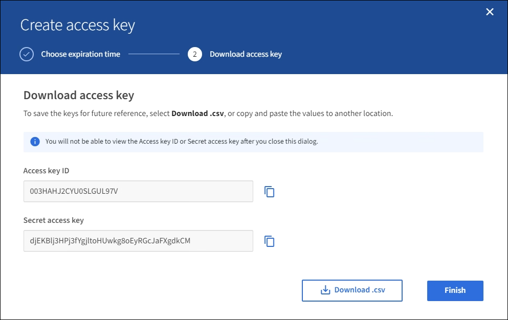

= Erstellen Ihrer eigenen S3-Zugriffsschlüssel
:allow-uri-read: 
:icons: font
:imagesdir: ../media/

[role="lead"]
Wenn Sie einen S3-Mandanten verwenden und über die entsprechenden Berechtigungen verfügen, können Sie Ihre eigenen S3-Zugriffsschlüssel erstellen. Für den Zugriff auf Buckets und Objekte im S3-Mandantenkonto ist ein Zugriffsschlüssel erforderlich.

.Was Sie und#8217;ll benötigen
* Sie müssen mit einem beim Mandantenmanager angemeldet sein xref:../admin/web-browser-requirements.adoc[Unterstützter Webbrowser].
* Sie müssen über die Berechtigung zum Verwalten Ihrer eigenen S3-Anmeldedaten verfügen. Siehe xref:tenant-management-permissions.adoc[Mandantenmanagement-Berechtigungen].

Sie können einen oder mehrere S3-Zugriffsschlüssel erstellen und managen, mit denen Sie Buckets für Ihr Mandantenkonto erstellen und verwalten können. Nachdem Sie einen neuen Zugriffsschlüssel erstellt haben, aktualisieren Sie die Anwendung mit Ihrer neuen Zugriffsschlüssel-ID und dem geheimen Zugriffsschlüssel. Erstellen Sie aus Sicherheitsgründen nicht mehr Schlüssel, als Sie benötigen, und löschen Sie die nicht verwendeten Schlüssel. Wenn Sie nur einen Schlüssel haben und demnächst ablaufen, erstellen Sie einen neuen Schlüssel, bevor der alte Schlüssel abläuft, und löschen Sie dann den alten Schlüssel.

Jeder Schlüssel kann eine bestimmte Ablaufzeit haben oder keinen Ablauf haben. Beachten Sie die folgenden Richtlinien für die Ablaufzeit:

* Legen Sie eine Ablaufzeit für Ihre Schlüssel fest, um den Zugriff auf einen bestimmten Zeitraum zu beschränken. Durch die Einrichtung einer kurzen Ablaufzeit kann Ihr Risiko verringert werden, wenn Ihre Zugriffsschlüssel-ID und Ihr geheimer Zugriffsschlüssel versehentlich ausgesetzt sind. Abgelaufene Schlüssel werden automatisch entfernt.
* Wenn das Sicherheitsrisiko in Ihrer Umgebung gering ist und Sie keine regelmäßigen neuen Schlüssel erstellen müssen, müssen Sie keine Ablaufzeit für Ihre Schlüssel festlegen. Wenn Sie sich zu einem späteren Zeitpunkt für die Erstellung neuer Schlüssel entscheiden, löschen Sie die alten Schlüssel manuell.

IMPORTANT: Sie können auf die S3-Buckets und Objekte aus Ihrem Konto zugreifen, indem Sie die Zugriffsschlüssel-ID und den geheimen Zugriffsschlüssel verwenden, die für Ihr Konto im Mandanten-Manager angezeigt werden. Aus diesem Grund schützen Sie Zugriffsschlüssel wie ein Passwort. Drehen Sie regelmäßig Zugriffsschlüssel, entfernen Sie alle nicht verwendeten Schlüssel aus Ihrem Konto und teilen Sie sie niemals mit anderen Benutzern.

.Schritte
. Wählen Sie *STORAGE (S3)* *Meine Zugriffsschlüssel* aus.
+
Die Seite Meine Zugriffsschlüssel wird angezeigt und enthält alle vorhandenen Zugriffsschlüssel.

. Wählen Sie *Schlüssel erstellen*.
. Führen Sie einen der folgenden Schritte aus:
+
** Wählen Sie *Verfallszeit nicht festlegen*, um einen Schlüssel zu erstellen, der nicht abläuft. (Standard)
** Wählen Sie *Verfallszeit festlegen*, und legen Sie das Ablaufdatum und die Uhrzeit fest.
+
image::../media/tenant_s3_access_key_create_save.png[Screenshot des Dialogfelds Zugriffsschlüssel erstellen]

. Wählen Sie *Zugriffsschlüssel erstellen*.
+
Das Dialogfeld Zugriffsschlüssel herunterladen wird angezeigt, in dem Ihre Zugriffsschlüssel-ID und Ihr geheimer Zugriffsschlüssel aufgeführt sind.

. Kopieren Sie die Zugriffsschlüssel-ID und den Schlüssel für den geheimen Zugriff an einen sicheren Ort, oder wählen Sie *.csv herunterladen*, um eine Tabellenkalkulationsdatei mit der Zugriffsschlüssel-ID und dem geheimen Zugriffsschlüssel zu speichern.
+

IMPORTANT: Schließen Sie dieses Dialogfeld erst, wenn Sie diese Informationen kopiert oder heruntergeladen haben. Nachdem das Dialogfeld geschlossen wurde, können Sie die Schlüssel nicht kopieren oder herunterladen.

+

. Wählen Sie *Fertig*.
+
Die neue Taste wird auf der Seite eigene Zugriffsschlüssel angezeigt. Änderungen können aufgrund des Caching bis zu 15 Minuten dauern.

