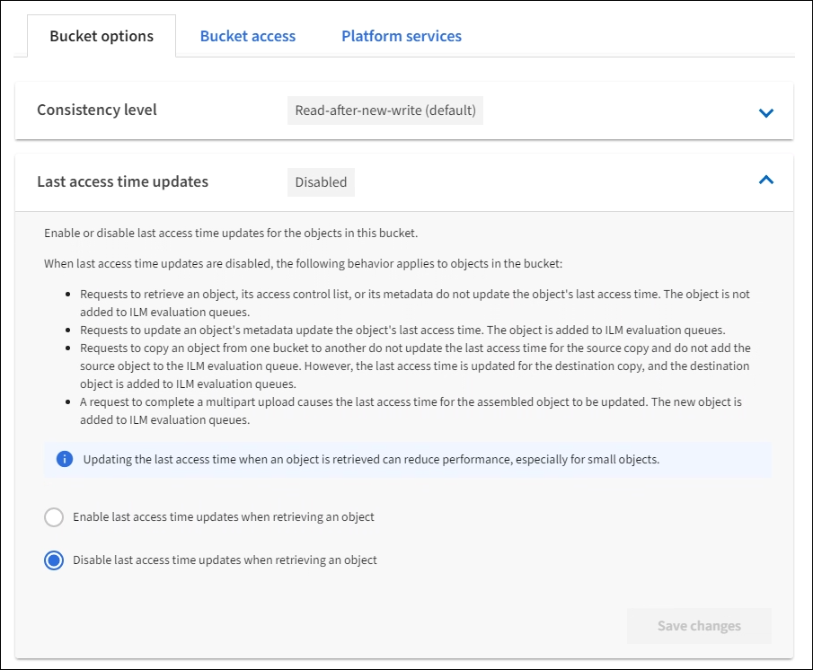

= Aktiviert bzw. deaktiviert Updates der letzten Zugriffszeit
:allow-uri-read: 
:icons: font
:imagesdir: ../media/

[role="lead"]
Wenn Grid-Administratoren die Regeln für das Information Lifecycle Management (ILM) für ein StorageGRID-System erstellen, können sie optional angeben, dass die letzte Zugriffszeit eines Objekts verwendet wird, um zu bestimmen, ob das Objekt auf einen anderen Storage-Standort verschoben werden soll. Wenn Sie einen S3-Mandanten verwenden, können Sie diese Regeln nutzen, indem Sie Updates der letzten Zugriffszeit für die Objekte in einem S3-Bucket aktivieren.

Diese Anweisungen gelten nur für StorageGRID-Systeme, die mindestens eine ILM-Regel enthalten, die die Option *Last Access Time* in ihrer Platzierungsanleitung verwendet. Sie können diese Anweisungen ignorieren, wenn Ihr StorageGRID System eine solche Regel nicht enthält.

.Was Sie und#8217;ll benötigen
* Sie müssen mit einem beim Mandantenmanager angemeldet sein xref:../admin/web-browser-requirements.adoc[Unterstützter Webbrowser].
* Sie müssen einer Benutzergruppe angehören, die über die Berechtigung Alle Buckets verwalten oder Root Access verfügt. Diese Berechtigungen überschreiben die Berechtigungseinstellungen in Gruppen- oder Bucket-Richtlinien. Siehe xref:tenant-management-permissions.adoc[Mandantenmanagement-Berechtigungen].

*Letzter Zugriffszeitpunkt* ist eine der Optionen für die *Referenzzeit*-Platzierungsanweisung für eine ILM-Regel. Durch Festlegen der Referenzzeit für eine Regel auf Letzter Zugriffszeit können Grid-Administratoren festlegen, dass Objekte an bestimmten Speicherorten platziert werden, basierend auf dem Zeitpunkt, an dem diese Objekte zuletzt abgerufen wurden (gelesen oder angezeigt).

Um z. B. sicherzustellen, dass kürzlich angezeigte Objekte im schnelleren Storage verbleiben, kann ein Grid-Administrator eine ILM-Regel erstellen, die Folgendes angibt:

* Objekte, die im letzten Monat abgerufen wurden, sollten auf lokalen Speicherknoten verbleiben.
* Objekte, die im letzten Monat nicht abgerufen wurden, sollten an einen externen Standort verschoben werden.

NOTE: Weitere Informationen finden Sie in den Anweisungen zum Verwalten von Objekten mit Information Lifecycle Management.

Standardmäßig werden Updates zur letzten Zugriffszeit deaktiviert. Wenn Ihr StorageGRID-System eine ILM-Regel enthält, die die Option *Last Access Time* verwendet und diese Option auf Objekte in diesem Bucket angewendet werden soll, müssen Sie Aktualisierungen für die letzte Zugriffszeit für die in dieser Regel festgelegten S3-Buckets aktivieren.

IMPORTANT: Durch das Aktualisieren der letzten Zugriffszeit, zu der ein Objekt abgerufen wird, kann sich die StorageGRID-Performance insbesondere für kleine Objekte reduzieren.

Eine Performance-Beeinträchtigung wird durch die letzten Updates der Zugriffszeit beeinflusst, da StorageGRID jedes Mal, wenn Objekte abgerufen werden, die folgenden zusätzlichen Schritte durchführen muss:

* Aktualisieren Sie die Objekte mit neuen Zeitstempel
* Fügen Sie die Objekte zur ILM-Warteschlange hinzu, damit sie anhand aktueller ILM-Regeln und Richtlinien neu bewertet werden können

Die Tabelle fasst das Verhalten zusammen, das auf alle Objekte im Bucket angewendet wird, wenn die letzte Zugriffszeit deaktiviert oder aktiviert ist.

[cols="1a,1a,1a,1a,1a"]
|===

.2+| Art der Anfrage 2+| Verhalten, wenn die letzte Zugriffszeit deaktiviert ist (Standard) 2+| Verhalten, wenn die letzte Zugriffszeit aktiviert ist 

| Zeitpunkt des letzten Zugriffs aktualisiert? | Das Objekt wurde zur ILM-Auswertungswarteschlange hinzugefügt? | Zeitpunkt des letzten Zugriffs aktualisiert? | Das Objekt wurde zur ILM-Auswertungswarteschlange hinzugefügt? 

 a| 
Anforderung zum Abrufen eines Objekts, seiner Zugriffssteuerungsliste oder seiner Metadaten
 a| 
Nein
 a| 
Nein
 a| 
Ja.
 a| 
Ja.

 a| 
Anforderung zum Aktualisieren der Metadaten eines Objekts
 a| 
Ja.
 a| 
Ja.
 a| 
Ja.
 a| 
Ja.

 a| 
Anforderung zum Kopieren eines Objekts von einem Bucket in einen anderen
 a| 
* Nein, für die Quellkopie
* Ja, für die Zielkopie

 a| 
* Nein, für die Quellkopie
* Ja, für die Zielkopie

 a| 
* Ja, für die Quellkopie
* Ja, für die Zielkopie

 a| 
* Ja, für die Quellkopie
* Ja, für die Zielkopie

 a| 
Anforderung zum Abschließen eines mehrteiligen Uploads
 a| 
Ja, für das zusammengesetzte Objekt
 a| 
Ja, für das zusammengesetzte Objekt
 a| 
Ja, für das zusammengesetzte Objekt
 a| 
Ja, für das zusammengesetzte Objekt

|===
.Schritte
. Wählen Sie *STORAGE (S3)* *Buckets* aus.
. Wählen Sie den Bucket-Namen aus der Liste aus.
+
Die Seite mit den Bucket-Details wird angezeigt.

. Wählen Sie *Bucket-Optionen* *Letzte Aktualisierung der Zugriffszeit* aus.
. Wählen Sie das entsprechende Optionsfeld aus, um Aktualisierungen der letzten Zugriffszeit zu aktivieren oder zu deaktivieren.
+

. Wählen Sie *Änderungen speichern*.

xref:tenant-management-permissions.adoc[Mandantenmanagement-Berechtigungen]

xref:../ilm/index.adoc[Objektmanagement mit ILM]
