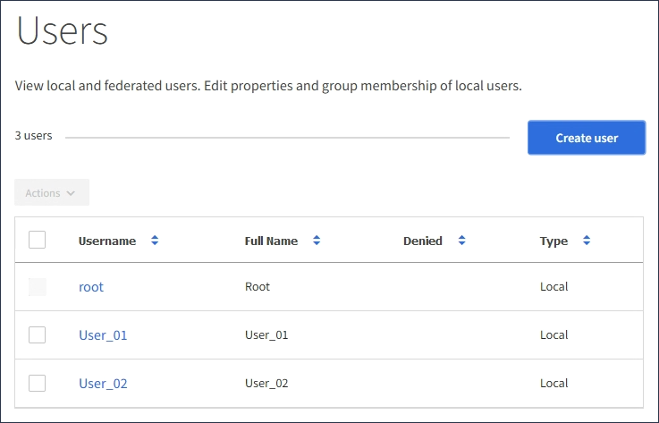

= Managen Sie lokale Benutzer
:allow-uri-read: 
:icons: font
:imagesdir: ../media/

[role="lead"]
Sie können lokale Benutzer erstellen und lokalen Gruppen zuweisen, um zu bestimmen, auf welche Funktionen diese Benutzer zugreifen können. Der Mandantenmanager enthält einen vordefinierten lokalen Benutzer mit dem Namen „`root`“. Obwohl Sie lokale Benutzer hinzufügen und entfernen können, können Sie den Root-Benutzer nicht entfernen.

.Was Sie und#8217;ll benötigen
* Sie müssen mit einem beim Mandantenmanager angemeldet sein xref:../admin/web-browser-requirements.adoc[Unterstützter Webbrowser].
* Sie müssen zu einer Lese-/Schreib-Benutzergruppe mit Root Access-Berechtigung gehören. Siehe xref:tenant-management-permissions.adoc[Mandantenmanagement-Berechtigungen].

NOTE: Wenn Single Sign-On (SSO) für Ihr StorageGRID-System aktiviert ist, können sich lokale Benutzer nicht beim Mandanten-Manager oder bei der Mandantenmanagement-API anmelden, auch wenn sie mithilfe von S3- oder Swift-Client-Applikationen auf die Ressourcen des Mandanten zugreifen können, basierend auf Gruppenberechtigungen.

== Öffnen Sie die Seite Benutzer

Wählen Sie *ZUGRIFFSVERWALTUNG* *Benutzer*.

== Erstellen Sie lokale Benutzer

Sie können lokale Benutzer erstellen und sie einer oder mehreren lokalen Gruppen zuweisen, um ihre Zugriffsberechtigungen zu steuern.

S3-Benutzer, die keiner Gruppe angehören, haben keine Managementberechtigungen oder S3-Gruppenrichtlinien auf sie angewendet. Diese Benutzer haben möglicherweise S3-Bucket-Zugriff, der über eine Bucket-Richtlinie gewährt wird.

Swift-Benutzer, die keiner Gruppe angehören, haben weder Managementberechtigungen noch Swift-Container-Zugriff.

.Schritte
. Wählen Sie *Benutzer erstellen*.
. Füllen Sie die folgenden Felder aus.
+
** *Vollständiger Name*: Der vollständige Name für diesen Benutzer, zum Beispiel der vor- und Nachname einer Person oder der Name einer Anwendung.
** *Benutzername*: Der Name, den dieser Benutzer zur Anmeldung verwendet. Benutzernamen müssen eindeutig sein und können nicht geändert werden.
** *Passwort*: Ein Passwort, das bei der Anmeldung des Benutzers verwendet wird.
** *Passwort bestätigen*: Geben Sie dasselbe Passwort ein, das Sie im Feld Passwort eingegeben haben.
** *Zugriff verweigern*: Wenn Sie *Ja* wählen, kann sich dieser Benutzer nicht beim Mandantenkonto anmelden, obwohl der Benutzer noch zu einer oder mehreren Gruppen gehört.
+
Als Beispiel können Sie diese Funktion verwenden, um die Fähigkeit eines Benutzers, sich anzumelden, vorübergehend auszusetzen.

. Wählen Sie *Weiter*.
. Weisen Sie den Benutzer einer oder mehreren lokalen Gruppen zu.
+
Benutzer, die keiner Gruppe angehören, haben keine Verwaltungsberechtigungen. Berechtigungen sind kumulativ. Benutzer haben alle Berechtigungen für alle Gruppen, denen sie angehören.

. Wählen Sie *Benutzer erstellen*.
+
Änderungen können aufgrund des Caching bis zu 15 Minuten dauern.

== Benutzerdetails bearbeiten

Wenn Sie die Details für einen Benutzer bearbeiten, können Sie den vollständigen Namen und das Kennwort des Benutzers ändern, den Benutzer zu verschiedenen Gruppen hinzufügen und verhindern, dass der Benutzer auf den Mandanten zugreift.

.Schritte
. Wählen Sie in der Liste Benutzer den Namen des Benutzers aus, dessen Details Sie anzeigen oder bearbeiten möchten.
+
Alternativ können Sie das Kontrollkästchen für den Benutzer aktivieren und dann *Aktionen* *Benutzerdetails anzeigen* wählen.

. Nehmen Sie bei Bedarf Änderungen an den Benutzereinstellungen vor.
+
.. Ändern Sie den vollständigen Namen des Benutzers nach Bedarf, indem Sie den vollständigen Namen oder das Bearbeiten-Symbol auswählen image:../media/icon_edit_tm.png["Symbol bearbeiten"] Im Abschnitt Übersicht.
+
Sie können den Benutzernamen nicht ändern.

.. Ändern Sie auf der Registerkarte *Passwort* das Kennwort des Benutzers nach Bedarf.
.. Auf der Registerkarte *Zugriff* können Sie sich anmelden (wählen Sie *Nein*) oder verhindern, dass sich der Benutzer bei Bedarf anmelden kann (wählen Sie *Ja*).
.. Fügen Sie auf der Registerkarte *Groups* den Benutzer zu Gruppen hinzu, oder entfernen Sie den Benutzer aus Gruppen nach Bedarf.
.. Wählen Sie nach Bedarf für jeden Abschnitt *Änderungen speichern*.
+
Änderungen können aufgrund des Caching bis zu 15 Minuten dauern.

== Duplizieren lokaler Benutzer

Sie können einen lokalen Benutzer duplizieren, um einen neuen Benutzer schneller zu erstellen.

.Schritte
. Wählen Sie in der Liste Benutzer den Benutzer aus, den Sie duplizieren möchten.
. Wählen Sie *Benutzer duplizieren*.
. Ändern Sie die folgenden Felder für den neuen Benutzer.
+
** *Vollständiger Name*: Der vollständige Name für diesen Benutzer, zum Beispiel der vor- und Nachname einer Person oder der Name einer Anwendung.
** *Benutzername*: Der Name, den dieser Benutzer zur Anmeldung verwendet. Benutzernamen müssen eindeutig sein und können nicht geändert werden.
** *Passwort*: Ein Passwort, das bei der Anmeldung des Benutzers verwendet wird.
** *Passwort bestätigen*: Geben Sie dasselbe Passwort ein, das Sie im Feld Passwort eingegeben haben.
** *Zugriff verweigern*: Wenn Sie *Ja* wählen, kann sich dieser Benutzer nicht beim Mandantenkonto anmelden, obwohl der Benutzer noch zu einer oder mehreren Gruppen gehört.
+
Als Beispiel können Sie diese Funktion verwenden, um die Fähigkeit eines Benutzers, sich anzumelden, vorübergehend auszusetzen.

. Wählen Sie *Weiter*.
. Wählen Sie eine oder mehrere lokale Gruppen aus.
+
Benutzer, die keiner Gruppe angehören, haben keine Verwaltungsberechtigungen. Berechtigungen sind kumulativ. Benutzer haben alle Berechtigungen für alle Gruppen, denen sie angehören.

. Wählen Sie *Benutzer erstellen*.
+
Änderungen können aufgrund des Caching bis zu 15 Minuten dauern.

== Lokale Benutzer löschen

Sie können lokale Benutzer dauerhaft löschen, die nicht mehr auf das StorageGRID-Mandantenkonto zugreifen müssen.

Mit dem Tenant Manager können Sie lokale Benutzer löschen, aber keine föderierten Benutzer. Sie müssen die föderierte Identitätsquelle verwenden, um verbundene Benutzer zu löschen.

.Schritte
. Aktivieren Sie in der Liste Benutzer das Kontrollkästchen für den lokalen Benutzer, den Sie löschen möchten.
. Wählen Sie *Aktionen* *Benutzer löschen*.
. Wählen Sie im Bestätigungsdialogfeld *Benutzer löschen* aus, um zu bestätigen, dass Sie den Benutzer aus dem System löschen möchten.
+
Änderungen können aufgrund des Caching bis zu 15 Minuten dauern.

