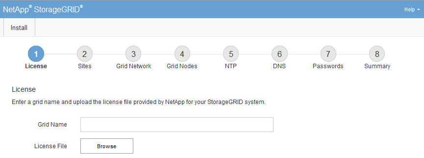

= Navigieren Sie zum Grid Manager
:allow-uri-read: 
:icons: font
:imagesdir: ../media/

[role="lead"]
Mit dem Grid Manager können Sie alle Informationen definieren, die für die Konfiguration des StorageGRID Systems erforderlich sind.

Der primäre Admin-Node muss bereitgestellt werden und die anfängliche Startsequenz abgeschlossen haben.

.Schritte
. Öffnen Sie Ihren Webbrowser, und navigieren Sie zu einer der folgenden Adressen:

[listing]
----
https://primary_admin_node_ip

client_network_ip
----
Alternativ können Sie auf den Grid Manager an Port 8443 zugreifen:

[listing]
----
https://primary_admin_node_ip:8443
----

NOTE: Sie können die IP-Adresse für die primäre Admin-Knoten-IP im Grid-Netzwerk oder im Admin-Netzwerk, je nach Ihrer Netzwerkkonfiguration, verwenden.

. Klicken Sie auf *StorageGRID-System installieren*.
+
Die Seite zum Konfigurieren eines StorageGRID-Rasters wird angezeigt.

+

