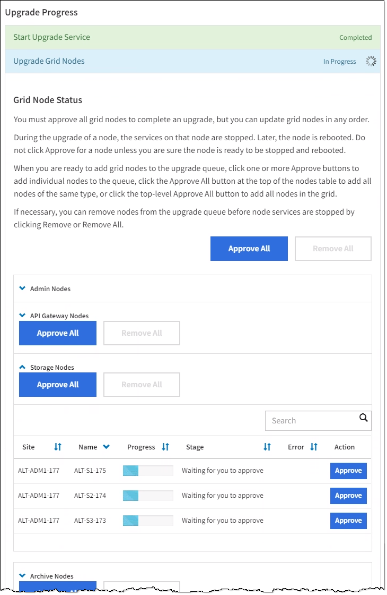

= Führen Sie das Upgrade durch
:allow-uri-read: 
:icons: font
:imagesdir: ../media/

[role="lead"]
Wenn Sie bereit sind, das Upgrade auszuführen, wählen Sie die aus `.upgrade` Archivieren Sie die Provisionierungs-Passphrase, und geben Sie sie ein. Als Option können Sie die Upgrade-Vorabprüfungen durchführen, bevor Sie das tatsächliche Upgrade durchführen.

.Was Sie benötigen
Sie haben alle Überlegungen geprüft und alle Planungs- und Vorbereitungsschritte durchgeführt.

== Laden Sie die Aktualisierungsdatei hoch

. Melden Sie sich mit einem bei Grid Manager an xref:../admin/web-browser-requirements.adoc[Unterstützter Webbrowser].
. Wählen Sie *Wartung* *System* *Software-Update*.
+
Die Seite Software-Aktualisierung wird angezeigt.

. Wählen Sie *StorageGRID-Upgrade*.
. Wählen Sie auf der Seite StorageGRID-Aktualisierung die Option aus `.upgrade` Archivierung:
+
.. Wählen Sie *Durchsuchen*.
.. Datei suchen und auswählen: `NetApp_StorageGRID_11.6.0_Software_uniqueID.upgrade`
.. Wählen Sie *Offen*.
+
Die Datei wird hochgeladen und validiert. Wenn der Validierungsprozess abgeschlossen ist, wird neben dem Dateinamen der Aktualisierungsdatei ein grünes Häkchen angezeigt.

. Geben Sie die Provisionierungs-Passphrase in das Textfeld ein.
+
Die Schaltflächen *Run Prechecks* und *Start Upgrade* werden aktiviert.

+
image::../media/storagegrid_upgrade_buttons_enabled.png[Die Schaltflächen für die StorageGRID-Aktualisierung sind aktiviert]

== Führen Sie Tests im Vorfeld durch

Optional können Sie den Zustand Ihres Systems validieren, bevor Sie das tatsächliche Upgrade starten. Durch die Auswahl von *Vorprüfungen ausführen* können Sie Probleme erkennen und beheben, bevor Sie das Upgrade starten. Die gleichen Vorabprüfungen werden durchgeführt, wenn Sie das Upgrade starten. Durch eine Vorabprüfung der Fehler wird der Upgrade-Prozess gestoppt und bei einigen Problemen ist zur Lösung die Beteiligung des technischen Supports erforderlich.

. Wählen Sie *Vorprüfungen Ausführen*.
. Warten Sie, bis die Vorabprüfungen abgeschlossen sind.
. Befolgen Sie die Anweisungen, um alle gemeldeten Vorprüffehler zu beheben.
+

IMPORTANT: Wenn Sie benutzerdefinierte Firewall-Ports geöffnet haben, werden Sie während der Vorabprüfung-Validierung benachrichtigt. Bevor Sie das Upgrade durchführen, müssen Sie sich an den technischen Support wenden.

== Starten Sie das Upgrade und aktualisieren Sie den primären Admin-Node

Wenn das Upgrade startet, werden Vorabprüfungen durchgeführt und der primäre Admin-Node aktualisiert. Dieser umfasst auch das Stoppen von Services, das Aktualisieren der Software sowie den Neustart der Services. Sie können nicht auf den Grid Manager zugreifen, während der primäre Admin-Node aktualisiert wird. Auch Audit-Protokolle sind nicht verfügbar. Dieses Upgrade kann bis zu 30 Minuten in Anspruch nehmen.

. Wenn Sie bereit sind, das Upgrade auszuführen, wählen Sie *Upgrade starten*.
+
Es wird eine Warnung angezeigt, die Sie daran erinnert, dass die Verbindung Ihres Browsers beim Neustart des primären Admin-Knotens unterbrochen wird.

+
image::../media/software_upgrade_connection_will_be_lost.png[Die Verbindung Zum Software-Upgrade Geht Verloren]

. Wählen Sie * OK*, um die Warnung zu bestätigen und den Aktualisierungsvorgang zu starten.
. Warten Sie, bis die Vorabprüfungen durchgeführt werden und der primäre Admin-Node aktualisiert wird.
+

NOTE: Wenn Fehler bei der Vorprüfung gemeldet werden, beheben Sie diese und wählen Sie erneut *Upgrade starten*.

+
Während der primäre Admin-Knoten aktualisiert wird, erscheinen mehrere *503: Dienst nicht verfügbar* und *Problem beim Herstellen einer Verbindung zum Server* Meldungen, die Sie ignorieren können.

+
image::../media/software_upgrade_503_error.png[Fehler Beim Software-Upgrade 503]

+
image::../media/software_upgrade_problem_connecting_error.png[Fehler Bei Der Verbindung Des Software-Upgrades]

. Wenn Sie die Meldung *400: Bad Request* sehen, fahren Sie mit dem nächsten Schritt fort. Das Admin-Knoten-Upgrade ist abgeschlossen.
+
image::../media/software_upgrade_400_error.png[Fehler Beim Software-Upgrade 400]

== Löschen Sie den Browser-Cache, und melden Sie sich wieder an

. Nachdem der primäre Admin-Knoten aktualisiert wurde, löschen Sie den Cache Ihres Webbrowsers und melden Sie sich wieder an.
+
Anweisungen hierzu finden Sie in der Dokumentation Ihres Webbrowsers.

+

IMPORTANT: Sie müssen den Cache des Webbrowsers löschen, um veraltete Ressourcen zu entfernen, die von der vorherigen Version der Software verwendet werden.

+
Die neu gestaltete Grid Manager-Schnittstelle wird angezeigt, was bedeutet, dass der primäre Admin-Node aktualisiert wurde.

+
image::../media/grid_manager_dashboard.png[Grid Manager Dashboard]

. Wählen Sie in der Seitenleiste die Option *WARTUNG*, um das Menü Wartung zu öffnen.
. Wählen Sie im Abschnitt *System* die Option *Software-Update*.
. Wählen Sie im Abschnitt *StorageGRID-Upgrade* die Option *Upgrade*.
. Überprüfen Sie den Abschnitt „Aktualisierungsfortschritt“ auf der Seite „StorageGRID-Aktualisierung“, auf der Sie Informationen zu allen wichtigen Aktualisierungsaufgaben erhalten.
+
.. *Start Upgrade Service* ist die erste Upgrade-Aufgabe. Während dieser Aufgabe wird die Softwaredatei auf die Grid-Nodes verteilt und der Upgrade-Service gestartet.
.. Wenn die Aufgabe *Upgrade Service* starten abgeschlossen ist, startet die Aufgabe *Grid Nodes aktualisieren*.
.. Während der Task *Grid-Knoten aktualisieren* ausgeführt wird, wird die Tabelle Status des Grid-Knotens angezeigt und die Aktualisierungsstufe für jeden Grid-Knoten in Ihrem System angezeigt.

== Laden Sie das Recovery-Paket herunter, und aktualisieren Sie alle Grid-Nodes

. Nachdem die Grid-Knoten in der Tabelle „Status des Grid-Nodes“ angezeigt wurden, jedoch vor Genehmigung von Grid-Nodes, xref:obtaining-required-materials-for-software-upgrade.adoc#download-the-recovery-package[Laden Sie eine neue Kopie des Wiederherstellungspakets herunter].
+

IMPORTANT: Sie müssen eine neue Kopie der Wiederherstellungspaket-Datei herunterladen, nachdem Sie die Softwareversion auf dem primären Admin-Knoten aktualisiert haben. Die Recovery Package-Datei ermöglicht es Ihnen, das System wiederherzustellen, wenn ein Fehler auftritt.

. Überprüfen Sie die Informationen in der Tabelle Status des Grid-Knotens. Die Grid-Nodes sind in Abschnitten nach Typ angeordnet: Admin Nodes, API-Gateway-Nodes, Storage-Nodes und Archiv-Nodes.
+

+
Ein Rasterknoten kann sich in einer dieser Phasen befinden, wenn diese Seite zuerst angezeigt wird:

+
** Fertig (nur primärer Admin-Node)
** Upgrade wird vorbereitet
** Software-Download in Warteschlange
** Download
** Warten auf Genehmigung

. Genehmigen Sie die Grid-Knoten, die Sie zur Upgrade-Warteschlange hinzufügen möchten.
+

IMPORTANT: Wenn das Upgrade auf einem Grid-Node startet, werden die Services auf diesem Node angehalten. Später wird der Grid-Node neu gebootet. Um Serviceunterbrechungen für Client-Applikationen zu vermeiden, die mit dem Node kommunizieren, genehmigen Sie das Upgrade nicht für einen Node, es sei denn, Sie stellen sicher, dass der Node bereit ist, angehalten und neu gebootet zu werden. Planen Sie bei Bedarf ein Wartungsfenster oder benachrichtigen Sie die Kunden.

+
Sie müssen alle Grid-Nodes in Ihrem StorageGRID System aktualisieren, die Upgrade-Sequenz kann jedoch angepasst werden. Sie können einzelne Grid-Nodes, Gruppen von Grid-Nodes oder alle Grid-Nodes genehmigen.

+
Wenn die Reihenfolge des Upgrades von Nodes wichtig ist, genehmigen Sie Knoten oder Gruppen von Knoten jeweils eins und warten Sie, bis das Upgrade auf jedem Knoten abgeschlossen ist, bevor Sie den nächsten Knoten oder die nächste Gruppe von Nodes genehmigen.

+
** Wählen Sie eine oder mehrere *Genehmigen*-Schaltflächen, um einen oder mehrere einzelne Knoten zur Upgrade-Warteschlange hinzuzufügen. Wenn Sie mehrere Knoten desselben Typs genehmigen, werden die Knoten nacheinander aktualisiert.
** Wählen Sie in jedem Abschnitt die Schaltfläche *Alle genehmigen* aus, um alle Knoten desselben Typs zur Upgrade-Warteschlange hinzuzufügen.
** Wählen Sie die oberste Ebene *Alle genehmigen*-Taste, um alle Knoten im Raster zur Upgrade-Warteschlange hinzuzufügen.
** Wählen Sie *Entfernen* oder *Alle entfernen*, um einen Knoten oder alle Knoten aus der Upgrade-Warteschlange zu entfernen. Sie können einen Knoten nicht entfernen, wenn seine Stufe *Stoppdienste* erreicht. Die Schaltfläche *Entfernen* ist ausgeblendet.
+
image::../media/software_upgrade_two_nodes_queued.png[Screenshot zeigt, dass die Dienste angehalten werden]

. Warten Sie, bis jeder Knoten die Upgrade-Phasen durchlaufen hat, einschließlich Queued, Stoppen von Services, Stoppen von Containern, Reinigen von Docker-Images, Aktualisieren von Basis-OS-Paketen, Neustarten, Ausführen von Schritten nach dem Neustart, Starten von Services und Fertig.
+

NOTE: Wenn ein Appliance-Knoten die Phase der Upgrade-Base-BS-Pakete erreicht, wird die Installationssoftware für die StorageGRID-Appliance auf der Appliance aktualisiert. Durch diesen automatisierten Prozess wird sichergestellt, dass die Installationsversion der StorageGRID Appliance mit der StorageGRID-Softwareversion synchronisiert bleibt.

== Upgrade abgeschlossen

Wenn alle Grid-Knoten die Upgrade-Stufen abgeschlossen haben, wird die Aufgabe *Upgrade Grid Nodes* als abgeschlossen angezeigt. Die verbleibenden Upgrade-Aufgaben werden automatisch und im Hintergrund ausgeführt.

. Sobald die Aufgabe *Enable Features* abgeschlossen ist (die schnell erfolgt), können Sie optional die neuen Features in der aktualisierten StorageGRID-Version nutzen.
. Während der Task *Upgrade Database* überprüft der Upgradeprozess jeden Knoten, ob die Cassandra-Datenbank nicht aktualisiert werden muss.
+

NOTE: Für das Upgrade von StorageGRID 11.5 auf 11.6 ist kein Cassandra Datenbank-Upgrade erforderlich. Allerdings wird der Cassandra-Service auf jedem Storage-Node angehalten und neu gestartet. Bei künftigen StorageGRID-Funktionsversionen kann der Schritt für das Update der Cassandra-Datenbank mehrere Tage dauern.

. Wenn der Task *Upgrade Database* abgeschlossen ist, warten Sie einige Minuten, bis die Aufgabe *Final Upgrade Steps* abgeschlossen ist.
+
Nach Abschluss der Aufgabe „Letzte Upgrade-Schritte“ wird das Upgrade durchgeführt.

== Upgrade bestätigen

. Bestätigen Sie, dass das Upgrade erfolgreich abgeschlossen wurde.
+
.. Wählen Sie oben im Grid Manager das Hilfesymbol aus und wählen Sie *über* aus.
.. Vergewissern Sie sich, dass die angezeigte Version den Erwartungen entspricht.
.. Wählen Sie *WARTUNG* *System* *Software-Update*.
.. Wählen Sie im Abschnitt *StorageGRID Upgrade* die Option *Upgrade*.
.. Vergewissern Sie sich, dass der grüne Banner zeigt, dass das Software-Upgrade zu dem erwarteten Datum und der erwarteten Uhrzeit abgeschlossen wurde.
+
image::../media/software_upgrade_done.png[Software-Upgrade Abgeschlossen]

. Prüfen Sie auf der Seite StorageGRID-Upgrade, ob Hotfixes für die aktuelle StorageGRID-Version verfügbar sind.
+

NOTE: Wenn kein Update-Pfad angezeigt wird, kann Ihr Browser möglicherweise nicht die NetApp Support Site erreichen. Oder das Kontrollkästchen *Software-Updates suchen* auf der AutoSupport-Seite (*SUPPORT* *Tools* *AutoSupport*) ist möglicherweise deaktiviert.

. Wenn ein Hotfix verfügbar ist, laden Sie die Datei herunter. Verwenden Sie dann den xref:../maintain/storagegrid-hotfix-procedure.adoc[StorageGRID Hotfix Verfahren] Zum Anwenden des Hotfix.
. Überprüfen Sie, ob die Grid-Vorgänge wieder den normalen Status aufweisen:
+
.. Überprüfen Sie, ob die Dienste normal funktionieren und keine unerwarteten Warnmeldungen vorliegen.
.. Vergewissern Sie sich, dass die Client-Verbindungen zum StorageGRID-System wie erwartet funktionieren.

