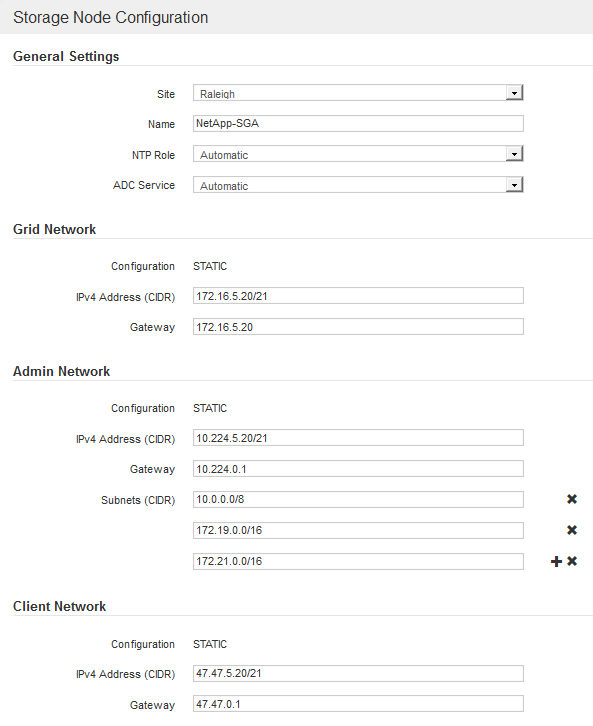

= Ausstehende Grid-Nodes genehmigen
:allow-uri-read: 
:icons: font
:imagesdir: ../media/

[role="lead"]
Sie müssen jeden Grid-Node genehmigen, bevor er dem StorageGRID System beitreten kann.

.Was Sie benötigen
Sie haben alle virtuellen und StorageGRID Appliance Grid-Nodes implementiert.

IMPORTANT: Es ist effizienter, eine einzelne Installation aller Nodes durchzuführen, anstatt zu einem späteren Zeitpunkt einige Nodes zu installieren.

.Schritte
. Prüfen Sie die Liste ausstehender Nodes und bestätigen Sie, dass alle von Ihnen bereitgestellten Grid-Nodes angezeigt werden.
+

NOTE: Wenn ein Grid-Node fehlt, bestätigen Sie, dass er erfolgreich bereitgestellt wurde.

. Aktivieren Sie das Optionsfeld neben einem Knoten, der noch nicht genehmigt werden soll.
+
image::../media/5_gmi_installer_grid_nodes_pending.gif[Dieses Bild wird durch den umgebenden Text erläutert.]

. Klicken Sie Auf *Genehmigen*.
. Ändern Sie unter Allgemeine Einstellungen die Einstellungen für die folgenden Eigenschaften, falls erforderlich:
+

+
** *Standort*: Der Name der Site, mit der dieser Grid-Knoten verknüpft wird.
** *Name*: Der Name, der dem Knoten zugewiesen wird, und der Name, der im Grid Manager angezeigt wird. Der Name ist standardmäßig auf den Namen eingestellt, den Sie beim Konfigurieren des Nodes angegeben haben. In diesem Schritt des Installationsprozesses können Sie den Namen nach Bedarf ändern.
+

IMPORTANT: Nachdem Sie die Installation abgeschlossen haben, können Sie den Namen des Node nicht ändern.

+

NOTE: Bei einem VMware-Knoten können Sie hier den Namen ändern, aber durch diese Aktion wird nicht der Name der virtuellen Maschine in vSphere geändert.

** *NTP-Rolle*: Die NTP-Rolle (Network Time Protocol) des Grid-Knotens. Die Optionen sind *Automatic*, *Primary* und *Client*. Bei Auswahl von *automatisch* wird die primäre Rolle Administratorknoten, Speicherknoten mit ADC-Diensten, Gateway-Nodes und beliebigen Grid-Nodes mit nicht statischen IP-Adressen zugewiesen. Allen anderen Grid-Nodes wird die Client-Rolle zugewiesen.
+

IMPORTANT: Vergewissern Sie sich, dass mindestens zwei Nodes an jedem Standort auf mindestens vier externe NTP-Quellen zugreifen können. Wenn nur ein Node an einem Standort die NTP-Quellen erreichen kann, treten Probleme mit dem Timing auf, wenn dieser Node ausfällt. Durch die Festlegung von zwei Nodes pro Standort als primäre NTP-Quellen ist zudem ein genaues Timing gewährleistet, wenn ein Standort vom Rest des Grid isoliert ist.

** *ADC-Dienst* (nur Speicherknoten): Wählen Sie *automatisch* aus, damit das System feststellen kann, ob der Knoten den Dienst Administrative Domain Controller (ADC) benötigt. Der ADC-Dienst verfolgt den Standort und die Verfügbarkeit von Grid-Services. Mindestens drei Storage-Nodes an jedem Standort müssen den ADC-Service enthalten. Der ADC-Dienst kann nicht einem Node hinzugefügt werden, nachdem er bereitgestellt wurde.

. Ändern Sie im Grid Network die Einstellungen für die folgenden Eigenschaften, falls erforderlich:
+
** *IPv4-Adresse (CIDR)*: Die CIDR-Netzwerkadresse für die Grid-Netzwerkschnittstelle (eth0 im Container). Zum Beispiel: 192.168.1.234/21
** *Gateway*: Das Grid Network Gateway. Beispiel: 192.168.0.1
+

NOTE: Das Gateway ist erforderlich, wenn es mehrere Grid-Subnetze gibt.

+

NOTE: Wenn Sie DHCP für die Grid-Netzwerkkonfiguration ausgewählt haben und hier den Wert ändern, wird der neue Wert als statische Adresse auf dem Knoten konfiguriert. Sie müssen sicherstellen, dass sich die resultierende IP-Adresse nicht in einem DHCP-Adressenpool befindet.

. Wenn Sie das Admin-Netzwerk für den Grid-Node konfigurieren möchten, fügen Sie die Einstellungen im Abschnitt Admin-Netzwerk bei Bedarf hinzu oder aktualisieren Sie sie.
+
Geben Sie die Zielnetze der Routen aus dieser Schnittstelle in das Textfeld *Subnetze (CIDR)* ein. Wenn mehrere Admin-Subnetze vorhanden sind, ist das Admin-Gateway erforderlich.

+

NOTE: Wenn Sie DHCP für die Konfiguration des Admin-Netzwerks ausgewählt haben und hier den Wert ändern, wird der neue Wert als statische Adresse auf dem Knoten konfiguriert. Sie müssen sicherstellen, dass sich die resultierende IP-Adresse nicht in einem DHCP-Adressenpool befindet.

+
*Appliances:* für eine StorageGRID-Appliance, wenn das Admin-Netzwerk während der Erstinstallation mit dem StorageGRID Appliance Installer nicht konfiguriert wurde, kann es in diesem Dialogfeld „Grid Manager“ nicht konfiguriert werden. Stattdessen müssen Sie folgende Schritte ausführen:

+
.. Starten Sie das Gerät neu: Wählen Sie im Appliance Installer die Option *Erweitert* *Neustart* aus.
+
Ein Neustart kann mehrere Minuten dauern.

.. Wählen Sie *Netzwerke konfigurieren* *Link-Konfiguration* und aktivieren Sie die entsprechenden Netzwerke.
.. Wählen Sie *Netzwerke konfigurieren* *IP-Konfiguration* und konfigurieren Sie die aktivierten Netzwerke.
.. Kehren Sie zur Startseite zurück und klicken Sie auf *Installation starten*.
.. In Grid Manager: Wenn der Knoten in der Tabelle genehmigte Knoten aufgeführt ist, setzen Sie den Knoten zurück.
.. Entfernen Sie den Knoten aus der Tabelle Ausstehende Knoten.
.. Warten Sie, bis der Knoten wieder in der Liste Ausstehende Knoten angezeigt wird.
.. Vergewissern Sie sich, dass Sie die entsprechenden Netzwerke konfigurieren können. Sie sollten bereits mit den Informationen ausgefüllt werden, die Sie auf der Seite IP-Konfiguration angegeben haben.
+
Weitere Informationen finden Sie in der Installations- und Wartungsanleitung für Ihr Gerätemodell.

. Wenn Sie das Client-Netzwerk für den Grid-Node konfigurieren möchten, fügen Sie die Einstellungen im Abschnitt Client-Netzwerk nach Bedarf hinzu oder aktualisieren Sie sie. Wenn das Client-Netzwerk konfiguriert ist, ist das Gateway erforderlich, und es wird nach der Installation zum Standard-Gateway für den Node.
+

NOTE: Wenn Sie DHCP für die Client-Netzwerkkonfiguration ausgewählt haben und hier den Wert ändern, wird der neue Wert als statische Adresse auf dem Knoten konfiguriert. Sie müssen sicherstellen, dass sich die resultierende IP-Adresse nicht in einem DHCP-Adressenpool befindet.

+
*Appliances:* für eine StorageGRID-Appliance, wenn das Clientnetzwerk während der Erstinstallation mit dem StorageGRID-Appliance-Installationsprogramm nicht konfiguriert wurde, kann es in diesem Dialogfeld „Grid Manager“ nicht konfiguriert werden. Stattdessen müssen Sie folgende Schritte ausführen:

+
.. Starten Sie das Gerät neu: Wählen Sie im Appliance Installer die Option *Erweitert* *Neustart* aus.
+
Ein Neustart kann mehrere Minuten dauern.

.. Wählen Sie *Netzwerke konfigurieren* *Link-Konfiguration* und aktivieren Sie die entsprechenden Netzwerke.
.. Wählen Sie *Netzwerke konfigurieren* *IP-Konfiguration* und konfigurieren Sie die aktivierten Netzwerke.
.. Kehren Sie zur Startseite zurück und klicken Sie auf *Installation starten*.
.. In Grid Manager: Wenn der Knoten in der Tabelle genehmigte Knoten aufgeführt ist, setzen Sie den Knoten zurück.
.. Entfernen Sie den Knoten aus der Tabelle Ausstehende Knoten.
.. Warten Sie, bis der Knoten wieder in der Liste Ausstehende Knoten angezeigt wird.
.. Vergewissern Sie sich, dass Sie die entsprechenden Netzwerke konfigurieren können. Sie sollten bereits mit den Informationen ausgefüllt werden, die Sie auf der Seite IP-Konfiguration angegeben haben.
+
Weitere Informationen finden Sie in der Installations- und Wartungsanleitung für Ihr Gerät.

. Klicken Sie Auf *Speichern*.
+
Der Eintrag des Rasterknoten wird in die Liste der genehmigten Knoten verschoben.

+
image::../media/7_gmi_installer_grid_nodes_approved.gif[Dieses Bild wird durch den umgebenden Text erläutert.]

. Wiederholen Sie diese Schritte für jeden ausstehenden Rasterknoten, den Sie genehmigen möchten.
+
Sie müssen alle Knoten genehmigen, die Sie im Raster benötigen. Sie können jedoch jederzeit zu dieser Seite zurückkehren, bevor Sie auf der Übersichtsseite auf *Installieren* klicken. Sie können die Eigenschaften eines genehmigten Grid-Knotens ändern, indem Sie das entsprechende Optionsfeld auswählen und auf *Bearbeiten* klicken.

. Wenn Sie die Genehmigung von Gitterknoten abgeschlossen haben, klicken Sie auf *Weiter*.

